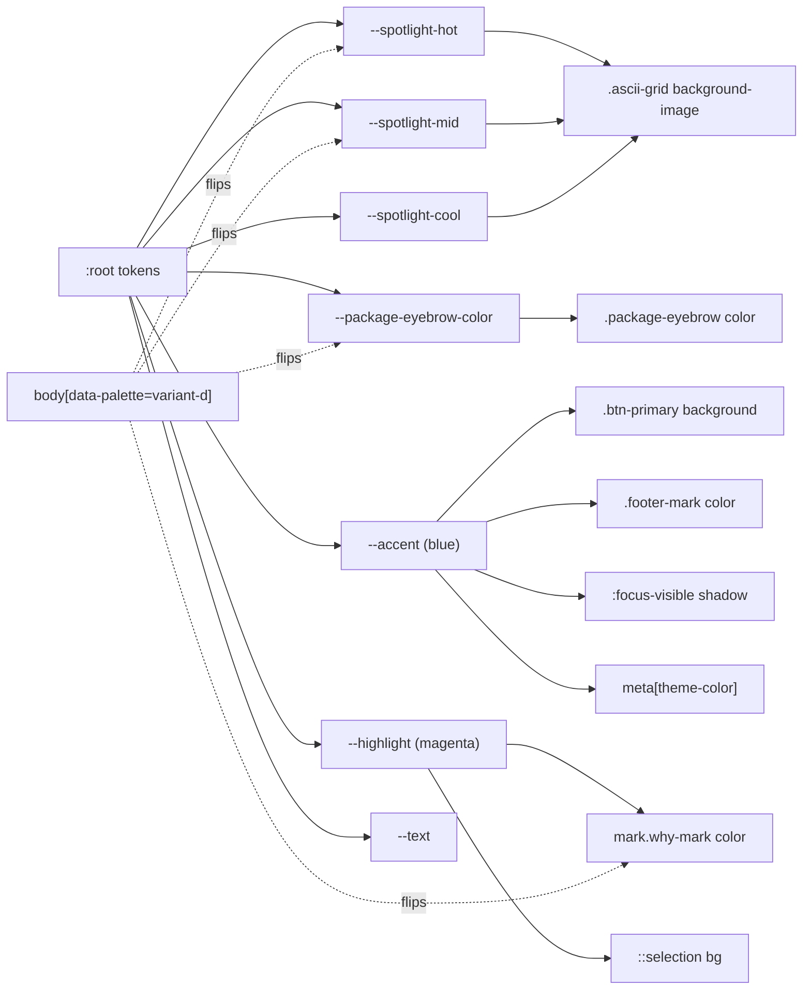
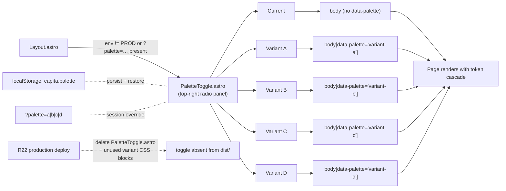
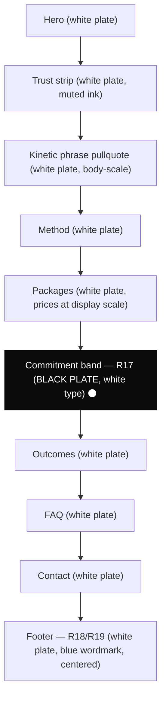
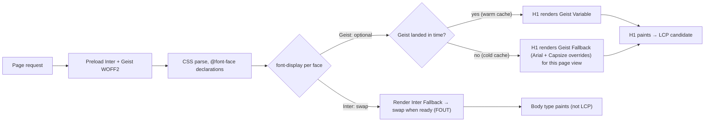
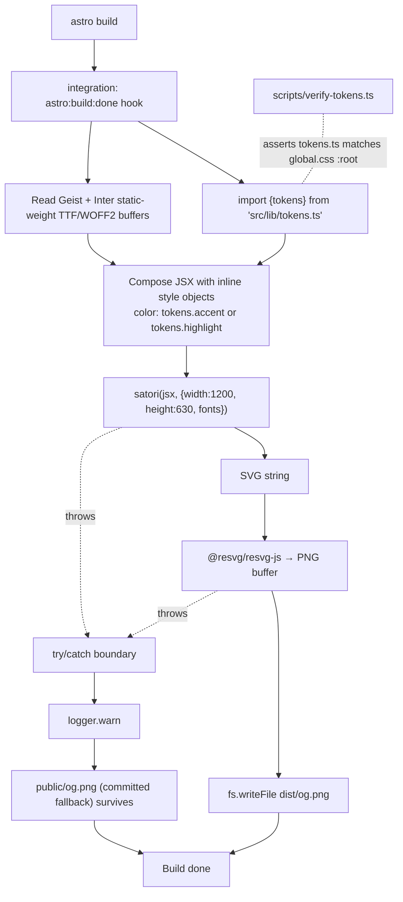

# feat: Browserbase-benchmark improvement pass

## Summary

This plan executes the 26-requirement improvement pass on the existing Cavaro idiom at the `feat/two-brand-launch` branch tip, organised as 16 implementation units across one bundled production deploy (R22). The pass demotes the ASCII grid to background atmosphere (R1), keeps the cursor spotlight as the sole interactive flourish while removing the Lissajous idle orbit (R2–R4), cuts the kinetic-phrase scroll transform (R5), promotes the four prices to display scale (R6–R8), consolidates the live typography to four tiers via a token rename audit (R9), rewrites the hero H1 to "We unleash your AI, customer growth, and productivity." with `unleash` as the emphasis word, rebuilds the OG share card as a static build-time PNG via satori + `@resvg/resvg-js` inside an Astro integration (R15) sourcing colour values from a shared `src/lib/tokens.ts`, introduces an **in-page palette toggle** (top-right corner radio panel, dev/preview-only, gated behind `import.meta.env`) that flips `body[data-palette]` between the current branch tip and four variants (A canonical / B blue-spotlight + magenta-surgical / C magenta-retired / **D = magenta-as-spotlight**) for founder selection in the live page context (R20), lands a typographic trust strip beneath the hero CTAs as a founder-confirmable placeholder (R21), and replaces the prior `font-display: optional` Geist trade with a build-time subset + base64 inline pipeline (U-14) so cold-cache visitors see Geist immediately and no Arial fallback face surfaces. Every round-2 contradiction (trust-strip contrast, pixel-art permissibility, monogram-rationale) is closed at plan time with a single decision per question. The plan adopts a sequencing constraint: toggle ships to preview → founder selects + ratifies trust strip → unused variant blocks and toggle component delete → R15 OG build runs → full bundle deploys to production.

---

## Problem Frame

Carried forward from origin verbatim: the current branch tip on `feat/two-brand-launch` shipped through an iterative design session on 2026-05-26. Compared against browserbase.com — clear, legible, on-trend, pixel artwork that works on desktop and mobile — three structural weaknesses surfaced: two competing identities and neither commits (the Cavaro ASCII grid and the Stripe-Press editorial type stack fight each other above the fold); the OG share card is the largest distinctiveness leak on the property; the colour system fires in non-reinforcing places. Three adversarial premium-brand lenses (CFO at a $2B AU regulated firm reading on mobile, brand-rules guardian, cohesion-and-craft reviewer) rejected the chunky-shadow CTAs, marker-block H1 highlights, edge-cropped wordmark, monospace numerals at display scale, and separate monogram that the comparative analysis initially imported as SaaS-landing-page vocabulary cheap on a $35k–$120k advisory page. This plan executes the moves that survived the adversarial filter.

The plan is bounded by the origin doc's Scope Boundaries three-way split (Deferred for later / Outside this redesign's identity / [plan-local] Deferred to Follow-Up Work) and inherits its writing-style rules from `docs/operational/session-handoff-2026-05-26.md`: spelled-out numerals 0–10, no terminal prepositions, no X-is-Y-not-X mirror trope.

---

## Requirements Trace

Every origin requirement is addressed by an implementation unit, an Acceptance Example, or an explicit deferral. R-IDs map to U-IDs below; AE-IDs are preserved verbatim from origin and extended in the Acceptance Examples section where adversarial verification surfaced gaps.

| Origin | Lands in | Notes |
|---|---|---|
| R1 grid ≤3% above fold | U-3 | Page-wide reduction to ≤5% deferred per origin Scope Boundaries. |
| R2 spotlight gated to hover+fine | U-4 | Preserved from prior brief. |
| R3 Lissajous removed | U-4 | Delete idle-orbit `requestAnimationFrame` loop in `src/layouts/Layout.astro` L184–314. |
| R4 spotlight contained to hero | U-4 | Containment measures against hero `<section>` bounding rect, not header bottom edge. |
| R5 kinetic-phrase transform removed | U-5 | Phrase demotes to body-pullquote; vacated display slot reassigns to promoted prices (R6). |
| R6 prices to display + tabular | U-6 | New token `--type-price-display`; `font-feature-settings: 'tnum', 'lnum'`. |
| R7 remove FROM eyebrow | U-6 | Inline lowercase "from" at half price-scale. |
| R8 mobile H1 floor + lede measure | U-6 | `--type-h1: clamp(48px, 11vw, 88px)`; lede ~28ch under 720px. |
| R9 four-tier typography | U-5, U-6, U-9 | Retire `--type-lede`, `--type-h3`, `--type-signature`, `--type-kinetic` as distinct tokens; consumers fold into Display / Section / Body / Micro. |
| R10 blue role-count | U-1, U-7 | Hard invariant: brand wordmark + focus rings. Per-variant: A=3, B=4, C=3, D=4. |
| R11 H1 noun colored ink | U-1 | Variant B/C = blue ink; A/D = magenta ink. No background block. |
| R12 CTAs flat fill | U-7 | Demote chunky-shadow + offset on CTAs only; form inputs / country picker / FAQ caret stay per origin Key Decision. |
| R13 four CTAs demoted | U-7 | Per-package buttons removed; nav-cta chrome demoted to plain text link; sticky-header anchor is sole wayfinding. |
| R14 no separate monogram | U-11, U-16 | Surface-scoped per resolution: favicon/touch-icon/PWA = wordmark-derived reduction allowed; header/hero/footer/band/OG composition = wordmark renders complete. |
| R15 build-time OG card | U-12 | satori + `@resvg/resvg-js` inside Astro integration on `astro:build:done`; `public/og.png` fallback committed; ASCII-derived corner mark struck. |
| R16 favicon set | U-12 | Wordmark-derived; SVG + 32×32 PNG + 180×180 apple-touch + manifest + `<meta name="theme-color">`. |
| R17 full-bleed band | U-8 | Default: 90-day commitment line on black ground (`var(--text)`), white type. |
| R18 footer reorder | U-8 | Contact tiles above wordmark band. |
| R19 footer wordmark complete + centered | U-8 | Keep `.footer-band { justify-content: center; }`; verify `.footer-mark` clamp at 320–2560px. |
| R20 four palette variants | U-1, U-2 | `/palette-study` route + four variant routes + two comparison sheets; Variant D = magenta-as-spotlight. |
| R21 trust strip | U-9 | `color-mix(in srgb, var(--text) 60%, var(--bg))` = `#6d6d6e` = 5.17:1 on white = AA pass. |
| R22 single deploy | All Us | Dependency graph documented below; OG build asserts emphasis-colour parity with live tokens. |
| R23 LCP ≤2.5s mobile p75 | U-14, U-15 | PerformanceObserver harness + 5-run Lighthouse on baseline and bundle. |
| R24 WCAG AA | U-9, U-13, others | Trust strip + R17 band + per-palette typographic surfaces verified before merge. |
| R25 ASCII grid ARIA | U-11 | `aria-hidden="true"` alone (drop `role="presentation"` — triggers axe-core `presentation-role-conflict`). |
| R26 FAQ ≤200ms accordion | U-10 | `grid-template-rows: 0fr ↔ 1fr` with inner wrapper; `+` rotates 45° on open; `transition: none` under reduced-motion. |

---

## Key Technical Decisions

### KTD-1 — Static build-time OG card via satori + `@resvg/resvg-js` inside an Astro integration

**Decision.** Implement `src/integrations/og-card/` as an Astro integration that hooks `astro:build:done`, composes JSX with resolved hex tokens (not Tailwind classes — satori implements a CSS subset, not full CSS), runs the JSX through `satori` to an SVG string, then through `@resvg/resvg-js` to a 1200×630 PNG, and writes `dist/og.png`. Static-weight Geist and Inter buffers loaded from `@fontsource/geist/files/geist-latin-400-normal.woff2` and equivalents (variable fonts are not accepted by satori — must pin static TTF/WOFF2 weights). A committed `public/og.png` ships as the always-present fallback; the integration wraps the satori/resvg block in try/catch and emits `logger.warn` on failure so the build never breaks the deploy.

**Why.** Origin Scope Boundaries explicitly rejects dynamic OG generation (`@vercel/og`, satori-at-request). The brief mandates a build-time static export. Astro 6.2 integrations are the supported extension point; `astro:build:done` runs after all routes render so the H1 copy and palette tokens are deterministic by then. satori + resvg is the canonical satori-style pipeline outside Vercel's edge runtime — works in Node 22 without edge dependencies.

**Implications.**
- New deps in `package.json` `dependencies`: `satori`, `@resvg/resvg-js`, `@fontsource/geist` (static), `@fontsource/inter` (static — the variable subpackages already exist).
- Build asserts emphasis-colour parity with live `--accent` (Variants B/C) or `--highlight` (Variants A/D) — fail-closed on drift.
- PR-review check: when source JSX changes materially, regenerate the committed `public/og.png` fallback.

**Alternative considered.** Pre-built static PNG committed to the repo, updated manually per release. Loses parity-assertion safety; founder iteration on palette/emphasis colour silently leaves the OG card stale.

### KTD-2 — Subset Geist Variable to ASCII and inline as base64 in critical CSS

**Decision.** Replace the standard `@fontsource-variable/geist` `@font-face` declaration with a build-time pipeline that (1) subsets Geist Variable to the character set actually used on `/` (ASCII + any accented characters the H1, prices, and section headings consume), (2) base64-encodes the subset WOFF2 into a `data:font/woff2;base64,…` URL inside the `@font-face` block, (3) inlines that `@font-face` block into the `<head>` as critical CSS so it arrives with the HTML. `font-display: block` (or no `font-display` declaration) — the subset is small enough that the browser has the font available before first paint and the H1 paints in Geist immediately. Inter Variable keeps `font-display: swap` (body type, FOUT acceptable, not the LCP element). The standard external Geist Variable WOFF2 preload (`Layout.astro` L55–61) can be dropped or retained as a redundancy for non-H1 characters; verification gate is U-15.

**Why.** The product-lens review flagged the prior `font-display: optional` choice as an identity contradiction: cold-cache visitors arriving from a LinkedIn URL paste — the exact audience the plan optimises for elsewhere — would have seen the Arial fallback for the whole visit. Subsetting Geist to the characters the page actually uses brings the file size from ~50–80kB down to ~5–10kB. At that weight the font fits inside critical CSS as base64 and loads with the HTML rather than after a separate font request. No swap window, no fallback face, no CLS, no LCP regression at the cold-cache audience.

**Implications.**
- New build step using `subset-font` (or `fonttools`/`pyftsubset` if Python is acceptable) hooked into Astro's build pipeline. Likely an `astro:build:setup` integration or a small pre-build script.
- Character set discovery: scan rendered HTML output at build time to compute the actual glyph set, or hard-code the ASCII + Latin Extended-A range that the H1, prices, and headings need.
- The Geist Variable Fallback rule and Capsize/Fontaine override values at `src/styles/global.css` L11–27 can be removed entirely — there's no fallback face to align.
- Verify total critical-CSS payload (inlined `@font-face` + base64 + first-paint CSS) stays under reasonable thresholds (target <30kB total inlined). Measured via U-15.

**Fallback path.** If the subset+inline approach cannot hit the R23 LCP gate (≤2.5s p75 mobile on Lighthouse), fall back to `font-display: swap` on Geist with the existing preload — cold-cache visitors see Arial briefly then Geist swaps in (small text layout shift accepted). The previous `font-display: optional` proposal is no longer in the option set.

**Alternative considered.** `font-display: optional` (the original KTD-2 choice). Rejected on product-lens grounds — see CO-7 strike below.

### KTD-3 — LCP element identity verified by `PerformanceObserver` before R6 lands

**Decision.** Add a dev/preview-only `PerformanceObserver` snippet (entryType `largest-contentful-paint`) that logs the LCP element and `startTime` to console. Run on baseline (`main`), on the branch tip, and on each post-R6 preview to confirm the H1 stays the LCP element after price promotion to `clamp(40px, 5vw, 64px)`. The snippet is not shipped to production.

**Why.** R-RISK-6: the plan claims the H1 is LCP based on source reading, not measurement. R6 introduces a second display-scale element below the hero; on certain viewports the prices block may enter LCP candidacy. Verifying empirically before merge prevents the OG card's emphasis-colour parity assertion (KTD-1) from drifting silently.

**Implications.**
- U-15 measurement gate runs after U-3/U-4/U-5/U-6 land on a preview, before R22 production deploy.
- Record LCP element identity + `startTime` p75 in `docs/operational/` alongside the existing 2026-05-26 handoff.

### KTD-4 — Trust-strip ink via `color-mix(in srgb, var(--text) 60%, var(--bg))`, not `opacity: 0.6`

**Decision.** R21 trust strip renders `color: color-mix(in srgb, var(--text) 60%, var(--bg));` over the white hero plate. Computed colour `#6d6d6e`; contrast ratio against white = 5.17:1; passes WCAG AA 4.5:1 for normal text at 14–15px. Strip ground is locked to the white hero plate by hard invariant; any future variant that moves the strip's background requires a recompute.

**Why.** The round-2 review identified R21 + R24 as internally contradictory: `#0b0b0d` at 60% opacity over `#ffffff` composites to ~`#9a9a9c` = ~3.0:1, an AA failure. `color-mix` swaps the alpha-composite for a deterministic colour value, surfaces the computed `#6d6d6e` in DevTools (debuggable), preserves the "deliberate, considered context" reading the brief intends (the strip reads muted, not primary), and meets AA at the declared 14–15px scale without raising scale.

**Implications.**
- Strike round-2 outstanding question (origin doc lines 298–302) when U-16 lands brief edits.
- New CSS rule on `.trust-strip` in `src/styles/global.css`; no opacity property.

**Alternative considered.** Raise opacity to 85% (5.3:1 AA pass). Rejected — 85% reads as primary content, defeats the "muted context" intent.

### KTD-5 — FAQ accordion via `grid-template-rows: 0fr ↔ 1fr` with inner wrapper

**Decision.** Replace the `panel.hidden = true/false` JS toggle with CSS-driven open/close. Each `.faq-a` panel becomes `display: grid; grid-template-rows: 0fr;` with a required inner wrapper `.faq-a-inner { min-height: 0; overflow: hidden; }`. Open state is driven entirely from `.faq-q[aria-expanded="true"] + .faq-a { grid-template-rows: 1fr; }`. The `+`/`−` caret swap becomes a single `+` rotated 45° on open via `transform: rotate(45deg)` (180ms ease-out). Under `prefers-reduced-motion: reduce`: `transition: none` (not `0ms`, which still produces a composited-layer flash).

**Why.** Origin R26 mandates ≤200ms total transition and `transition: none` under reduced motion. `grid-template-rows` interpolation is the cleanest 2026-evergreen CSS-transitionable height mechanism that preserves the single-open behaviour and keyboard contract from the prior brief without JS height measurement. `max-height: 0 ↔ 100vh` works but the timing distorts on long answers. `interpolate-size: allow-keywords` is Chrome 129+ only.

**Implications.**
- DOM change at `src/pages/index.astro` L392–394: each `.faq-a` div wraps its content in `<div class="faq-a-inner">`.
- JS at `src/layouts/Layout.astro` L543–572 (or wherever the accordion handler lives — verify line range during implementation) loses the `panel.hidden` toggle lines; only `aria-expanded` toggling remains.
- VoiceOver/NVDA verification: confirm collapsed-region content is not announced. Mitigation if announced: pair the grid collapse with `visibility: hidden ↔ visible`.

**Caret motion fallback (call-out CO-5).** If the rotated `+` reads as a glyph change rather than a state change to the founder during palette iteration, fall back to a `color` cross-fade on the existing `+`/`−` content swap (`transition: color 180ms ease-out`). R12 protects the chunky-caret category, not the specific glyph mechanism.

### KTD-6 — ASCII grid ARIA = `aria-hidden="true"` alone; drop `role="presentation"`

**Decision.** Revise R25's ARIA contract: the `<pre id="ascii-grid">` ships `aria-hidden="true"` only. Drop the `role="presentation"` part of the prior spec — combining a `role=presentation` with global ARIA states triggers ARIA's conflict-resolution rule and axe-core's `presentation-role-conflict` lint. Optional belt-and-braces: add `inert` alongside `aria-hidden` on the `<pre>` so the element is also removed from sequential focus / hit-testing.

**Why.** Verified against WAI-ARIA 1.2 conflict resolution and the axe-core rule docs during external research. `aria-hidden` alone is sufficient: the accessibility tree excludes the element and its descendants; the spotlight (a `background-image` gradient on the same element, not a separate node) is covered by the same attribute; CSS-custom-property mutations on inline style do not trigger live-region announcements.

**Implications.**
- Update R25 wording in the origin brief during U-16.
- AE11 verification surface stays a DOM proxy (axe-core scan / Playwright `ariaSnapshot` excluding the grid subtree), not an AT-only test.

### KTD-7 — In-page palette variant toggle (temporary), retired on R22

**Decision.** Add a temporary palette-variant toggle directly on the live homepage during the founder-iteration window. The toggle is a small fixed-position panel in the top-right corner with five radio options: **Current** (no `data-palette` attribute — the live branch tip rendering, what ships today), **Variant A** (magenta canonical), **Variant B** (blue spotlight + magenta surgical), **Variant C** (magenta retired), **Variant D** (magenta as spotlight). Selecting a radio sets `body.dataset.palette` and persists the choice to `localStorage`. The toggle reads `localStorage` on page load so the founder can navigate, share preview links with the variant pre-selected, and return without re-picking. The toggle UI and its script are guarded by an environment check (`import.meta.env.MODE !== 'production'` or `import.meta.env.DEV` plus a `?palette` query-string opt-in) and are deleted in the same commit that selects the winning variant — R22 production deploy contains no toggle code (asserted by AE7a below).

**Why.** Replaces the original `/palette-study` route + four variant routes + two comparison sheets proposal. The founder asked to evaluate variants in the actual live page context, not in a separate evaluation surface. The in-page toggle satisfies R20 (founder picks a variant from rendered prototypes) at a much smaller scope — no route extraction, no iframe isolation, no comparison sheets that don't authentically replicate mobile, no `HomeBody.astro` or `PaletteVariant.astro` wrappers, no `/palette-study/` directory to retire. The CSS-variable cascade still flips cleanly per `body[data-palette]` because the variant overrides live in a single `body[data-palette="…"]` block in `global.css`. Mobile and desktop evaluation both happen on the canonical `/` URL.

**Implications.**
- New `src/components/PaletteToggle.astro` (~30 lines) renders the radio panel; included by `Layout.astro` behind the dev/preview guard.
- New small client script (inline in the component or `src/scripts/palette-toggle.ts`) listens for radio change, writes `body.dataset.palette`, persists to `localStorage`, reads `localStorage` on init.
- AE7a (revised): R22 production deploy contains no `PaletteToggle` artefacts. Grep for `data-palette=` and `PaletteToggle` in the production build returns zero matches outside the variant CSS override block in `global.css`.
- The variant CSS override block in `global.css` stays — it's the substrate for whichever variant the founder selects. Selection retires the unused variants by deleting the override blocks for the rejected variants (a follow-up cleanup that can land alongside the toggle deletion).
- Founder shares preview deploy URLs with `?palette=a|b|c|d` (an alternative selection mechanism the toggle script also honours) so different reviewers see different variants without coordinating on the toggle UI.

### KTD-8 — Variant D = magenta-as-spotlight; tokens at `:root` overridden under `body[data-palette]`; default `/` renders the current branch tip

**Decision.** Variant D resolves as candidate (iii): magenta carries the spotlight gradient AND the H1 emphasis word; blue retracts to brand wordmark + focus rings + theme-color + primary CTA fill. Introduce new tokens at `:root`: `--spotlight-hot`, `--spotlight-mid`, `--spotlight-cool`, `--package-eyebrow-color`. **Default values match the current branch tip (Variant A — the live homepage today).** When no `data-palette` attribute is set on `body`, `/` renders pixel-identical to today; the toggle (KTD-7) flips `body.dataset.palette` to expose Variants A/B/C/D as overrides. The variant override block lives under `body[data-palette="variant-a"]` / `variant-b` / `variant-c` / `variant-d` in a single block at the bottom of `src/styles/global.css`. Variants A and D keep CTA blue; Variants B and C demote CTA to black fill. After founder selection, the unused variant override blocks delete and the winning variant's tokens promote into `:root`.

**Why.** Variants A–C are specified by the brief. Variant D's selection rule: pick the candidate whose render most directly answers the residual magenta-utilisation question A–C leave open. A canonical magenta retest answers nothing new in D; magenta-retired (C) is the conservative endpoint, not a stress test. Magenta-as-spotlight inverts the brand colour hierarchy and stress-tests whether the page's identity survives blue-as-restraint — a question A–C leave entirely untouched. The token surface chosen (4 new tokens, single override block) is implementation-compatible across A/B/C/D — a CSS-variable swap, not a structural layout change, as R20 requires. Defaulting to current-tip means U-1 lands as a zero-visual-change refactor on `/`: tokens introduced, `mark.why-mark` and `.btn-primary` continue to consume the same hex values they consume today, the four variant override blocks exist but only fire when the toggle sets `data-palette`. No sequencing-failure risk where `/` ships under an unselected variant.

**Per-variant role count for Capita blue.**

| Variant | Spotlight | H1 emphasis | Brand wordmark | Focus rings | CTA fill | Theme-color | Roles |
|---|---|---|---|---|---|---|---|
| Default (no `data-palette`) | blue | magenta ink | blue | blue | blue | blue | 5 (current tip) |
| A magenta canonical | blue | magenta ink | blue | blue | blue | blue | 5 |
| B blue-spotlight + magenta-surgical | blue | blue ink | blue | blue | black fill | blue | 4 |
| C magenta-retired | blue | blue ink | blue | blue | black fill | blue | 4 |
| D magenta-as-spotlight | magenta | magenta ink | blue | blue | blue | blue | 4 |

Hard invariant across all variants: blue retains brand wordmark + focus rings. The Default row matches Variant A; the toggle treats them as equivalent rendering states (toggle to "Current" = remove the `data-palette` attribute entirely; toggle to "Variant A" = set `data-palette="variant-a"` which renders identical CSS but exercises the override-block code path so the founder can confirm the variant block applies cleanly).

---

## High-Level Technical Design

Eight sketches the implementer needs to validate direction. Diagrams are directional guidance; the prose above is authoritative on disagreement.

### D-1 — Palette-token swap surface



### D-2 — In-page palette toggle topology



### D-3 — Page section flow + saturated-plate count



The black band at R17 is the sole full-bleed saturated plate per scroll. The footer wordmark is the closing brand stamp on a white plate. Variant D may move the saturated plate to a magenta band; the rule is "at most one per scroll", invariant across variants.

### D-4 — LCP / font-display decision tree



### D-5 — FAQ accordion mechanism (before → after)

```
BEFORE                                              AFTER
─────────                                          ─────────
button[aria-expanded="false"]                       button[aria-expanded="false"]
  └─ JS: click → aria-expanded="true"                 └─ JS: click → aria-expanded="true" (only)
  └─ JS: click → panel.hidden = false
                                                    (no panel.hidden toggle)
panel.faq-a[hidden] (binary)                        panel.faq-a {
  └─ CSS: padding 0 22px 22px;                        display: grid;
                                                      grid-template-rows: 0fr;
                                                      transition: grid-template-rows 180ms ease-out;
                                                    }
                                                    .faq-q[aria-expanded="true"] + .faq-a {
                                                      grid-template-rows: 1fr;
                                                    }
                                                    .faq-a-inner {
                                                      min-height: 0;
                                                      overflow: hidden;
                                                    }
                                                    .faq-q::after { content: "+"; }
                                                    .faq-q[aria-expanded="true"]::after {
                                                      transform: rotate(45deg);
                                                      transition: transform 180ms ease-out;
                                                    }
                                                    @media (prefers-reduced-motion: reduce) {
                                                      .faq-a, .faq-q::after { transition: none; }
                                                    }
```

### D-6 — OG-card build pipeline



### D-7 — Cursor-spotlight containment (R4)

```
┌──────────────────────────────────────────┐
│  Sticky header (z-50, backdrop-blur)     │
├──────────────────────────────────────────┤
│                                          │
│   <section aria-label="Hero">            │  ← R4 containment boundary
│                                          │    (bounding rect from JS getBoundingClientRect)
│   ┌────────────────────────────────┐    │
│   │  Spotlight active when         │    │    --mx, --my update only when
│   │  cursor inside this rect       │    │    cursor inside hero rect.
│   │                                │    │    Exit hero → freeze last position.
│   │  (hover:hover) +               │    │    Page hidden / reduced-motion →
│   │  (pointer:fine) only           │    │    static fallback (no JS loop).
│   └────────────────────────────────┘    │
│                                          │
├──────────────────────────────────────────┤
│  Trust strip (white plate)               │
│  Kinetic pullquote (white plate)         │
│  ...                                     │  ← No ambient motion below hero.
└──────────────────────────────────────────┘

ASCII grid <pre aria-hidden="true">  spans full viewport (z-index 0).
Above-the-fold tint = ≤3% ink (R1). Below-fold = 10% (handoff default).
Spotlight = background-image gradient on same <pre>, NOT a separate DOM node.
```

### D-8 — Contact-form state machine

```mermaid
stateDiagram-v2
  [*] --> Idle
  Idle --> Loading: user clicks submit
  Loading --> Success: Formspree 200
  Loading --> Error: Formspree 4xx/5xx or network
  Error --> Loading: user fixes + resubmits
  Success --> [*]

  state Idle {
    description: "Button always clickable. No pre-submit disabled state. R12 flat fill, full opacity."
  }
  state Loading {
    description: "Button text 'Sending…', disabled attribute, fill desaturates to 0.55 alpha, chassis stays full strength, cursor not-allowed, form aria-busy=true."
  }
  state Success {
    description: "Form display:none + aria-hidden=true. #formSuccess at --type-lede, focus moves to #formSuccess (tabindex=-1). Copy unchanged from current."
  }
  state Error {
    description: "#formError role=alert + aria-live=assertive (currently missing). Per-field aria-invalid=true. Error colour from new --color-error token (was hardcoded #b91c1c)."
  }
```

---

## Output Structure

The plan adds two integration trees (`src/integrations/og-card/` and `src/integrations/font-subset/`), one shared tokens file (`src/lib/tokens.ts`), one temporary toggle component (`src/components/PaletteToggle.astro`, retired on R22), and a small verification script.

```
src/
├── components/
│   └── PaletteToggle.astro             [NEW — temporary variant toggle, RETIRED on R22]
├── integrations/
│   ├── og-card/
│   │   ├── index.ts                    [NEW — Astro integration entry, astro:build:done hook]
│   │   └── composition.tsx             [NEW — JSX composition for satori, imports from src/lib/tokens.ts]
│   └── font-subset/
│       └── index.ts                    [NEW — Astro integration that subsets Geist Variable and inlines as base64 critical CSS]
├── layouts/
│   └── Layout.astro                    [modified — spotlight script update, kinetic script delete, font load swap, OG meta, conditional PaletteToggle inclusion, footer DOM reorder]
├── lib/
│   └── tokens.ts                       [NEW — single source of truth for hex token values; imported by OG composition]
├── pages/
│   └── index.astro                     [modified — H1 copy change, trust strip insertion, package CTA removal, commitment band promotion to R17 full-bleed, FAQ wrapper insertion]
└── styles/
    └── global.css                      [modified — tokens, four variant override blocks, R17 band, R21 strip, accordion CSS, CTA flatten, type tier rename, Geist fallback metrics removal]

scripts/
└── verify-tokens.ts                    [NEW — optional CI/dev sync check between tokens.ts and global.css :root]

public/
├── og.png                              [NEW — committed fallback for KTD-1]
├── favicon.svg                         [NEW — wordmark-derived, R16]
├── favicon-32.png                      [NEW — R16]
├── apple-touch-icon.png                [NEW — 180×180, R16]
└── manifest.json                       [NEW — R16 with theme_color: #0078f0]

docs/operational/
└── 2026-06-XX-lcp-measurements.md      [NEW — U-15 verification record]
```

The tree is a scope declaration. Implementers may adjust the layout if implementation reveals a better split. Per-unit `**Files:**` sections are authoritative.

---

## Scope Boundaries

### Deferred to Follow-Up Work (plan-local sequencing)

- Page-wide grid reduction to ≤5%. This plan ships ≤3% above the fold only (R1). The page-wide gate is a separate follow-up plan with its own deploy boundary.
- Brief edits land via U-16 *after* implementation Us merge to capture decisions taken in flight; until then the origin doc remains the source of truth.
- Copy iteration on the kinetic pullquote ("Operators, not consultants.") — the X-is-Y-not-X mirror trope flagged in the 2026-05-26 writing-style rules survives this pass because copy is locked at the branch tip (origin Scope Boundaries). A founder copy-iteration round can land it in a follow-up.

### Deferred for later (carried verbatim from origin)

- Real founder photo and bio copy. The founder section ships under its existing flag, gated until copy and photo are ready in a future change.
- Case studies, named or anonymised or composite.
- Blog or insights content stream.
- CMS introduction.
- Dynamic OG image generation (Vercel/og, satori-at-request).
- Per-section OG variants.
- Page-wide grid reduction to ≤5%.
- Quiet-authored-texture replacement for the ASCII grid (laid-paper grain, faint engraved rule pattern).

### Outside this redesign's identity (carried verbatim from origin, with one revision)

- Pixel art mascots, hero illustrations, or commissioned static playful artwork.
- **The cursor spotlight against the ASCII grid is the founder's maximum playful flourish for this pass.** *(Revised — closes the round-2 pixel-art-permissibility contradiction by adopting path (b). Additional restrained interactive pixel-art moments are not permitted in this pass; future candidates are logged as planning questions for subsequent passes.)*
- Chunky offset-shadow CTAs (the Cavaro / Browserbase / Linear / Resend vocabulary).
- Marker-block / solid-background-fill H1 noun highlights.
- Edge-cropped or amputated wordmark in the footer or elsewhere.
- Monospace numerals at display scale, and monospace-as-decoration for sector or label text.
- **Separately-designed monogram identity atoms adjacent to the wordmark on visible page surfaces** (header, hero, footer plate, trust strip, contact band, R17 band, OG card composition area). *(Revised — closes the round-2 monogram-rationale contradiction by adopting path (a). The favicon, apple-touch-icon, and PWA manifest icons are reductions derived from the wordmark and are NOT a separate monogram for this rule's purposes.)*
- Multi-page architecture, route-level navigation, additional routes (`/work`, `/about`, `/insights`, `/contact`).
- Copy rewrites. Content is locked at the branch tip.
- Changes to the contact form's API contract, Formspree endpoint, anti-spam mechanisms, or country-code data.
- Changes to the FAQ accordion's single-open behaviour or keyboard contract.
- New font families. Inter Variable + Geist Variable stays canonical.
- Re-litigating the editorial-vs-Cavaro premise debate from the prior brief.

---

## Risks & Dependencies

Plan-time risks the implementer should know.

| ID | Risk | Mitigation |
|---|---|---|
| R-RISK-1 | satori does not accept variable fonts with weight ranges. | Pin static TTF/WOFF2 weights from `@fontsource/geist` and `@fontsource/inter` subpackages in KTD-1. |
| R-RISK-2 | satori implements a CSS subset, not full CSS — Tailwind utility classes do not apply inside the JSX tree. | Compose inline `style` objects in the satori JSX. |
| R-RISK-3 | OG fallback PNG drifts when H1 copy or wordmark change. | Treat build-time PNG as canonical; PR-review check that the static fallback was regenerated when source JSX changed materially. |
| ~~R-RISK-4~~ | ~~`font-display: optional` on Geist means cold-cache first-time visitors render the H1 in the Geist Fallback (Arial).~~ | **Closed.** KTD-2 revised to subset Geist Variable and inline as base64 critical CSS (U-14). No fallback face seen on cold-cache visits. |
| R-RISK-5 | Geist Variable tabular figures (`'tnum', 'lnum'`) may not survive the latin-only subset. | Font-inspector check during U-6 implementation; fall back to monospace digit alignment via a single price-specific font fallback if features stripped. |
| R-RISK-6 | LCP element identity (H1 vs prices) is from source reading, not measurement. | U-15 `PerformanceObserver` verification before merging R6. |
| R-RISK-7 | R3/R5 cuts (~30–90 ms p75 mobile estimate) and the U-14 inlined-font subset both shift LCP; U-6's promoted prices become a second display-scale element that may briefly enter LCP candidacy. The net direction is unknown without measurement. | U-15 gate 2 confirms LCP element stays the H1 after U-6 lands; U-15 gate 3 confirms p75 ≤ 2.5s on the bundle. If gate 3 fails, U-14's fallback path (`font-display: swap` on external Geist preload) is the first action. |
| R-RISK-8 | Astro 6.2 `inlineStylesheets` default is `'auto'`. | Verified at plan time: `astro.config.mjs` has no `build.inlineStylesheets` override, so default `'auto'` applies. Default `'auto'` inlines stylesheets under ~4kb; `src/styles/global.css` is 1566 lines and well above that threshold. The existing two preloads (`Layout.astro` L55–61) remain the early-discovery path. Risk closed at plan time. |
| R-RISK-9 | Grid track interpolation on `.faq-a` is a layout transition (not compositor). | Mitigated by `overflow: hidden` on inner wrapper + single-open guarantee + below-fold position. If R23 measurement shows regression, fall back to caret-only animation. |
| R-RISK-10 | Removing the `hidden` attribute changes a11y-tree initial state. | Verify VoiceOver/NVDA do not announce collapsed-region content unexpectedly; if announced, pair the grid collapse with `visibility: hidden ↔ visible`. |
| R-RISK-11 | Spotlight `setProperty('--mx', ...)` per frame generates style-attribute MutationRecords. | Document; not a blocker. If a future third-party MutationObserver watches with `subtree: true, attributes: true` it receives thousands of records/s. |
| R-RISK-12 | Palette study routes must not be indexed during the iteration window. | `<meta name="robots" content="noindex">` on every palette-study route. Retirement (U-16 commit) is the permanent solution. |
| R-RISK-13 | Magenta `#d946ef` against white at 14px is ~4.6:1 — AA pass but marginal. | Trust strip never uses magenta ink (KTD-4 locks ground to white plate, ink to `color-mix(text, bg, 60%)`). If a future variant moves ink to magenta on white, recompute. |

### Dependencies

- Cal.com loader script behaviour preserved (below-the-fold for LCP).
- Formspree endpoint `https://formspree.io/f/xojdzarv` — unchanged per origin Scope Boundaries.
- AU country picker default + reset behaviour — preserved.
- The 2026-05-26 session handoff's writing-style rules (spelled-out numerals 0–10; no terminal prepositions; no X-is-Y-not-X mirror trope) bind any new copy this plan introduces (trust strip sector list is data, not prose — passes).
- Vercel hosting preserved.

---

## Implementation Units

Sixteen units. The dependency graph at "Build sequence (R22 dependency graph)" at the end of this plan is the canonical ordering. Group by build sequence below; each unit lists its own dependencies.

### U1. Palette tokenisation + shared tokens file + variant override blocks

**Goal:** Introduce spotlight + package-eyebrow tokens at `:root`; create a shared `src/lib/tokens.ts` source-of-truth file for the four hex values the build pipeline needs (OG card composition reads from it); refactor `.ascii-grid` spotlight gradient and `.package-eyebrow` to consume the new tokens; add the four `body[data-palette="variant-a|b|c|d"]` override blocks at the bottom of `global.css`. Default `:root` values match the current branch tip — `/` ships zero visual change.

**Requirements:** R10, R11, R20 (substrate).

**Dependencies:** none.

**Files:**
- `src/lib/tokens.ts` (new) — exports the four hex strings as named constants: `export const tokens = { accent: '#0078f0', accentHover: '#0069d1', highlight: '#d946ef', highlightHover: '#c026d3', text: '#0b0b0d', bg: '#ffffff' } as const;` Single source of truth for build-time pipelines (U-12 OG card imports from this).
- `src/styles/global.css` — new `:root` tokens (`--spotlight-hot`, `--spotlight-mid`, `--spotlight-cool`, `--package-eyebrow-color`) with default values matching current branch tip; refactor `.ascii-grid` spotlight gradient at L189–218 to consume them; refactor `.package-eyebrow` at L1425–1432; new four-block variant override section at end of file. `mark.why-mark` (L555–562) already has `background: transparent; color: var(--highlight);` — no edit required to the base rule, only the variant override block flips the `color`.
- `scripts/verify-tokens.ts` (new, optional) — one-line CI/dev assertion that the hex strings in `tokens.ts` match the `:root` declarations in `global.css`. Run via `pnpm verify:tokens` or as a build step. Keeps the two surfaces in sync.

**Approach:** Default `:root` values mirror the current branch tip exactly so `/` with no `data-palette` attribute renders pixel-identical to today. Spotlight gradient stops change per variant under the override blocks: A keeps current blue→ink→transparent + magenta hot center; B drops magenta from gradient; C drops magenta entirely; D inverts (magenta→ink→transparent, no blue in spotlight). H1 emphasis ink (`mark.why-mark color`) flips per variant: A/D = magenta, B/C = blue. CTA fill flips per variant: A/D = blue (default), B/C = black. Theme-color meta stays blue across all variants.

**Patterns to follow:** Existing token cascade at `global.css` L38–52, L91–95. CSS custom-property override pattern: `body[data-palette="variant-x"] { --token: value; }`. Existing `mark.why-mark` rule at L555–562 already follows R11 (transparent background, coloured ink) — no R11 violation to fix in the base rule, only per-variant `color` overrides to add.

**Test scenarios:**
- Default page render (no `data-palette` attribute) matches current branch tip pixel-for-pixel (visual regression baseline).
- `body[data-palette="variant-a"]` resolves tokens identical to the default state (Variant A is the canonical/current configuration).
- `body[data-palette="variant-b|c|d"]` resolves tokens per the KTD-8 role-count table (computed-style assertion).
- Reduced-motion fallback at `global.css` L231–238 still suppresses spotlight motion under each variant.
- `pnpm verify:tokens` reports zero drift between `src/lib/tokens.ts` and `global.css` `:root` declarations.
- Covers R10. Hard invariant: blue retains brand wordmark + focus rings under every variant.

**Verification:** Visual diff on `/` confirms zero change; toggle (U-2) confirms each variant's CSS override block applies cleanly.

### U2. In-page palette variant toggle (temporary)

**Goal:** Add a small fixed-position radio panel in the top-right corner of the live homepage that flips `body.dataset.palette` between five values (`""` = current/no attribute, `"variant-a"`, `"variant-b"`, `"variant-c"`, `"variant-d"`). Persist selection to `localStorage` and honour a `?palette=a|b|c|d` query-string override. Gate visibility behind a non-production check.

**Requirements:** R20.

**Dependencies:** U-1.

**Files:**
- `src/components/PaletteToggle.astro` (new, ~40 lines) — renders a small fixed-position panel in the top-right corner with the five radio options and a small "Variant: <name>" label. Includes the inline script that wires up `change` events, writes to `body.dataset.palette`, persists to `localStorage`, reads `localStorage` and `?palette=` query string on init.
- `src/layouts/Layout.astro` (modified) — conditionally includes `<PaletteToggle />` when `import.meta.env.PROD !== true` OR when the URL has `?palette=` in the query string. Guard logic prevents the toggle from appearing on production deploys.
- `src/styles/global.css` (modified) — adds the variant override blocks: `body[data-palette="variant-a"] { … }`, `body[data-palette="variant-b"] { … }`, `body[data-palette="variant-c"] { … }`, `body[data-palette="variant-d"] { … }`. (This is the work U-1's variant block sets up; U-2 verifies the toggle exercises it.)

**Approach:** Toggle UI is intentionally low-chrome: a small panel in the top-right corner with a single column of radio buttons plus the current variant name. No animation, no styling that competes with the page's design language. Visibility gate uses `import.meta.env.PROD` (Astro standard env discrimination) so the toggle is excluded from production builds at the bundler level — not just hidden via CSS. The `?palette=` query string is honoured so the founder can share a preview URL with a specific variant pre-selected (e.g., `https://capita-pr-…vercel.app/?palette=d` opens with Variant D). `localStorage` key: `capita.palette`. The toggle initialises by reading the URL query, falling back to localStorage, falling back to `""` (no attribute set).

**Patterns to follow:** Existing inline `<script>` blocks in `Layout.astro` (spotlight, kinetic phrase script — though those are being removed). Use the same vanilla-JS, no-framework style.

**Test scenarios:**
- Local dev (`pnpm dev`): toggle panel renders in the top-right at all viewports (does not overlap critical content; on 390 mobile it stays out of the hero region).
- Selecting Variant A/B/C/D sets `body.dataset.palette` and the page visually flips per KTD-8 table.
- Selecting "Current" removes the `data-palette` attribute and the page renders pixel-identical to the current branch tip (visual diff).
- Selection persists across page reloads (`localStorage` set).
- `?palette=d` query string opens with Variant D pre-selected, overriding any prior `localStorage` value for that session.
- Production build (`pnpm build` then inspect `dist/`): grep for `PaletteToggle` and `data-palette` in built HTML/JS returns zero matches outside the variant CSS override block in the bundled `global.css`. Covers AE7a.
- Covers R20 and AE7.

**Verification:** Founder evaluates variants on a Vercel preview deploy at both 1440 desktop and 390 mobile, navigating between variants via the toggle. Production deploy (R22) excludes the toggle entirely.

### U3. Grid tint reversal above the fold

**Goal:** Reverse the handoff state (10% above fold) to ≤3% above the fold; preserve calm-state and footer-state grid intensity behaviour.

**Requirements:** R1.

**Dependencies:** none.

**Files:**
- `src/styles/global.css` — `--grid-dot-default` and `--grid-dot-calm` tokens at L91–95. Confirm Layout.astro L423–476 grid-intensity script still maps to the new tokens correctly.

**Approach:** Token swap only. The sentinel-driven calm transition still works; the calm value drops proportionally (≤3% above fold becomes the default; below-fold sentinel transition stays as the brief specifies — page-wide ≤5% is a follow-up plan).

**Test scenarios:**
- At hero scroll position: grid renders at ≤3% ink against white.
- After sentinel crosses viewport: grid renders at the calm value (handoff default behaviour preserved on the section below the hero).
- Reduced-motion fallback unchanged.
- Covers R1.

**Verification:** Visual confirmation at 1440 desktop + 390 mobile; sentinel-driven transition still observable on scroll.

### U4. Cursor spotlight scope + Lissajous cut

**Goal:** Delete the Lissajous idle orbit; gate spotlight tracking to the hero `<section>` bounding rect on `(hover:hover) and (pointer:fine)` devices only; preserve reduced-motion suppression and Page Visibility handler correctness.

**Requirements:** R2, R3, R4.

**Dependencies:** none.

**Files:**
- `src/layouts/Layout.astro` L184–314 — delete idle-orbit `requestAnimationFrame` loop, period 4500ms / Y at 0.7× freq / radius `min(w,h)*0.42`; add `getBoundingClientRect`-based hero containment to `mousemove`; reduce active listeners on `mouseleave` of hero region.

**Approach:** Cursor inside hero rect → `--mx`/`--my` updates. Cursor outside (including header band and below hero) → freeze last position. Reduced-motion → static fallback (no listeners attached). Page hidden → MQ listener pause as today.

**Patterns to follow:** Existing matchMedia gating at the top of the spotlight IIFE; existing Page Visibility handler.

**Test scenarios:**
- Touch-only device (fails `(hover:hover) and (pointer:fine)`): no `requestAnimationFrame` loop runs for the spotlight. Covers AE1.
- Desktop with cursor + `prefers-reduced-motion: no-preference`: cursor exits hero region or viewport → spotlight does not begin idle drift / orbit / autonomous motion. Last position freezes. Covers AE2.
- Desktop with cursor inside hero rect: `--mx`/`--my` update each frame; spotlight tracks cursor.
- Reduced-motion media query: no listeners attached; spotlight gradient renders static.
- Page Visibility hidden: existing pause behaviour preserved.

**Verification:** DevTools Performance trace shows no `rAF` activity when cursor is outside hero rect or on touch-only devices.

### U5. Kinetic phrase demotion + four-tier typography token rename

**Goal:** Delete the `initKineticPhrase` IIFE; rewrite `.kinetic-phrase` CSS to body-pullquote scale at `--type-body` (italic, no full-bleed, no transform); remove `aria-hidden="true"` from the phrase wrapper. As part of this unit, complete the four-tier token rename mandated by R9: audit every consumer of `--type-lede`, `--type-h3`, `--type-signature`, `--type-kinetic` and rewrite each call site to the four-tier vocabulary (`--type-display`, `--type-section`, `--type-body`, `--type-micro`); delete the retired token declarations.

**Requirements:** R5, R9.

**Dependencies:** none.

**Files:**
- `src/layouts/Layout.astro` L316–372 — delete `initKineticPhrase` IIFE.
- `src/styles/global.css` L1273–1321 — rewrite `.kinetic-phrase` to `--type-body`, italic, max-width ~64ch, centered, no transform, no full-bleed.
- `src/styles/global.css` L69–77 — delete `--type-lede`, `--type-h3`, `--type-signature`, `--type-kinetic` token declarations; rename `--type-h1` to `--type-display`, `--type-h2` to `--type-section`, keep `--type-body`, `--type-micro`. Update every consumer of the retired tokens (grep `var\(--type-(lede|h3|signature|kinetic|h1|h2)` across `src/styles/global.css` and rewrite).
- `src/pages/index.astro` L225–229 — drop `aria-hidden="true"` from wrapper now that the phrase is announced as content.

**Approach:** The phrase reads as a body-scale pullquote between method and packages. No ambient motion. Vacated display slot reassigns to promoted prices in U-6. The token rename audit fully consummates R9's four-tier consolidation — no aliases, no surviving distinct-token names beyond the four. Audit step (mechanical): grep the retired token names in `src/styles/global.css` and replace each call site with the four-tier equivalent (`--type-lede` → `--type-body`, `--type-h3` → `--type-section`, `--type-signature` → `--type-body`, `--type-kinetic` → `--type-body`).

**Test scenarios:**
- Page contains no `rAF` activity on scroll (kinetic-phrase loop deleted).
- `.kinetic-phrase` element renders at `--type-lede` scale on both 1440 and 390.
- `aria-hidden` attribute absent; screen reader announces phrase text.
- Covers R5 (no ambient motion contribution).

**Verification:** DevTools Performance trace clean of `--kinetic-progress` writes; visual confirmation at both viewports.

### U6. Price promotion + H1 floor raise + H1 copy change

**Goal:** Introduce `--type-price-display: clamp(40px, 5vw, 64px)`; apply to `.package-eyebrow` with `font-feature-settings: 'tnum', 'lnum'`; remove `FROM` uppercase eyebrow treatment (R7); raise `--type-display` (was `--type-h1`) to `clamp(48px, 11vw, 88px)` from the current `clamp(40, 6.5vw, 88)`; tighten lede measure to ~28ch under 720px (R8). **Rewrite the hero H1 copy from "We help with AI, customer retention, and productivity." to "We unleash your AI, customer growth, and productivity."** with `unleash` as the operative emphasis word.

**Requirements:** R6, R7, R8 plus founder copy decision (overrides origin Scope Boundaries' copy lock on this string specifically).

**Dependencies:** U-5 (display slot vacated; token rename complete).

**Files:**
- `src/pages/index.astro` L207 — H1 copy change. New string: `We <mark class="why-mark">unleash</mark> your AI, customer growth, and productivity.` The existing emphasis mechanism (`mark.why-mark`) wraps the operative word and inherits R11's coloured-ink treatment.
- `src/styles/global.css` L69–77 — `--type-display` floor raise; new `--type-price-display`.
- `src/styles/global.css` L1425–1432 — `.package-eyebrow` consumes `--type-price-display`, adds `font-feature-settings: 'tnum', 'lnum'`.
- `src/pages/index.astro` L80, L95, L110, L124, L285 — verify lowercase "from" rendering (currently `From $XX,XXX`; the inline lowercase "from" reads at half-scale within the price string via a span-wrapped lowercase prefix `<span class="package-price-from">from</span> <span class="package-price-amount">$85,000</span>`).
- `src/styles/global.css` — lede max-width tightens to 28ch under 720px (`@media (max-width: 720px) { .lede { max-width: 28ch; } }`).

**Approach:** H1 copy change is a founder copy decision that overrides origin Scope Boundaries' copy lock on the H1 string specifically. The change shifts the H1 from descriptive ("We help") to active ("We unleash"), shifts "retention" to "growth" (broader business read), and pins `unleash` as the operative emphasis word (a verb rather than a noun — distinct from origin's R11 phrasing about "the operative noun"). Update any downstream references to "operative noun" wording in the plan and brief to read "operative word" since the founder selected a verb.

Price string remains `From $85,000` etc. semantically; the visual treatment renders "from" at ~half display scale inline and the numeral at full display scale via the wrapper-span mechanism above. The `FROM` uppercase eyebrow is removed by the same change.

**Patterns to follow:** Existing token cascade; existing `mark.why-mark` mechanism at `global.css` L555–562 (already R11-compliant).

**Test scenarios:**
- Hero H1 reads "We unleash your AI, customer growth, and productivity." with `unleash` wrapped in `<mark class="why-mark">`.
- The word `help` does not appear in the hero H1.
- The word `retention` does not appear in the hero H1 (still appears elsewhere if used in body copy — verify).
- Each package price (`$35,000`, `$45,000`, `$85,000`, `$120,000`) renders in Geist Variable at `--type-price-display` scale with tabular figures (digits align in fixed-width columns when stacked vertically). Covers AE4.
- The string `FROM` in uppercase does not appear anywhere on the page; lowercase `from` appears inline at half price-scale.
- Hero H1 floor at 390 viewport is 48px (raised from 40px).
- Hero lede wraps two lines (not three) at 390 viewport.
- LCP element remains the H1 (verified by U-15 measurement).

**Verification:** Visual at 1440 + 390; computed-style assertion that `.package-eyebrow` `font-feature-settings` includes both `tnum` and `lnum`.

### U7. CTA vocabulary demotion + per-package CTA removal + nav-cta demotion

**Goal:** Demote chunky-shadow vocabulary on CTAs (R12); remove per-package CTAs (R13); demote sticky-header `.nav-cta` chrome to plain text link to preserve AE3's two-CTA-count invariant.

**Requirements:** R12, R13.

**Dependencies:** U-1 (CTA fill colour depends on selected palette variant).

**Files:**
- `src/styles/global.css` L595–666 — `.btn-primary` flat fill (no `--chunky-shadow`); `.btn-secondary` solid border, no offset shadow; press state = single-pixel `translateY` on `:active` only.
- `src/styles/global.css` L335–344 — `.nav-cta` demotes from chunky bordered button to plain text link (preserve colour + weight signalling).
- `src/pages/index.astro` L274–276 — delete `.package-cta` div from each package card and the bespoke band's CTA.

**Approach:** Hero CTA pair retains `[href="#packages"]` and `[href="#bespoke"]`. Form submit retains its filled state per R13. Focus-visible behaviour preserved across all controls. The `.nav-cta` text link is colour + weight signalled, not chrome signalled — it survives the ≤840px breakpoint exclusion at `global.css` L363 and remains accessible as the sole wayfinding affordance to the contact form (per resolution 3.8 / call-out CO-8).

**Patterns to follow:** Existing `.btn` family base styles; existing `:active` translateY treatment if any.

**Test scenarios:**
- Screenshot at 1440 desktop + 390 mobile: count of filled CTA buttons **in the hero region** = exactly two (`.btn-primary` accent-fill + `.btn-secondary` bordered-white). Contact form submit is a third filled CTA on the page, located outside the hero region per AE3-revised. Header `.nav-cta` renders as a plain text link, not a filled CTA, and is also outside the hero region. Covers AE3.
- No solid-fill CTAs render on package cards, bespoke band, or founder section.
- Sticky header `.nav-cta` renders as plain text link, not chunky-shadow button; click-target preserved.
- Hero `.btn-primary` flat fill matches selected variant (blue under default/B/C is blue but with `--accent` background only; under D = `--accent` still — Variant D keeps CTA blue per KTD-8 table).
- Wait — under Variant B and C, CTA fill demotes to black per KTD-8 table. Verify the per-variant CSS override applies.
- `:active` press = single-pixel `translateY`; no offset-shadow stack.
- Focus-visible ring renders correctly via `--chunky-shadow-accent` token (still used for focus rings, not CTAs).
- Covers R12, R13, AE3.

**Verification:** Visual diff per variant route; AE3 screenshot count on `/` after R22.

### U8. R17 full-bleed band + R18/R19 footer reorder

**Goal:** Ship a full-bleed band carrying the 90-day commitment line at display scale on a black ground (`var(--text)`) with white type (R17); reorder the footer so contact tiles sit above the wordmark plate (R18); verify `.footer-mark` clamp does not overflow at any viewport width between 320 and 2560 (R19).

**Requirements:** R17, R18, R19.

**Dependencies:** U-1, U-7.

**Files:**
- `src/pages/index.astro` L298–305 — verify the current commitment band copy ("If, at the 90-day mark after your engagement closes, the leading indicators we defined together have not moved, we return for a no-fee follow-up week to find out why. This is written into every statement of work. It applies to every package on this page and to bespoke engagements.") and apply the full-bleed treatment to the section. The band stays between packages and outcomes per the current page order; no relocation needed.
- `src/styles/global.css` — new `.commitment-band` rules: `background: var(--text); color: var(--bg); width: 100vw; margin-inline: calc(50% - 50vw); padding-block: clamp(80px, 10vw, 160px); text-align: center;` — flat ground, no border, no card chrome. Type at `clamp(28px, 3vw, 40px)` (Section tier per R9), max-width 38ch.
- `src/layouts/Layout.astro` L133–165 — footer DOM reorder: move the `.footer-band` block (L134–136, the centred wordmark) below the `.footer-inner` block (L138–164, containing `.footer-links` at L140 and `.footer-tiles` at L149). Net result: `<footer>` opens (L133), `.footer-inner` (with tiles and links) renders first, `.footer-band` (with `.footer-mark` wordmark) renders last, `</footer>` closes. The centred wordmark band remains the page's final element.
- `src/styles/global.css` L424–430 — `.footer-band { justify-content: center; }` retained; verify `.footer-mark` clamp `clamp(4rem, 20vw, 18rem)` renders complete at 320, 720, 1100, 1440, 2560 viewport widths (no edge clipping, no horizontal overflow).

**Approach:** Default ships R17 black-band + R19 white-footer-with-blue-wordmark as the no-regret combination. Variant D may move the saturated plate to a magenta band; the rule is "at most one saturated full-bleed plate per scroll", invariant across variants.

**Patterns to follow:** Existing full-bleed pattern from the kinetic-phrase removal (`margin-inline: calc(50% - 50vw); width: 100vw`).

**Test scenarios:**
- R17 band renders edge-to-edge at every viewport width (no horizontal scrollbar introduced).
- 90-day commitment copy renders at Section tier (`clamp(28px, 3vw, 40px)`) with white ink on black ground; AA contrast verified (`#ffffff` on `#0b0b0d` = 20.96:1 — clear pass). Covers R24 for this surface.
- Single saturated full-bleed plate count = 1 on a page screenshot (the R17 band).
- Footer: contact tiles render above the wordmark plate.
- `.footer-mark` renders complete (no edge clipping) at 320, 720, 1100, 1440, 2560 widths. Covers AE9.
- Footer wordmark centred horizontally at every viewport.
- Covers R17, R18, R19, AE9.

**Verification:** Playwright assertion on `.footer-mark` `getBoundingClientRect().left >= 0` and `.right <= viewport.width` at each named viewport; manual visual at extremes.

### U9. Trust strip (R21) — placeholder shipped, founder confirms before R22

**Goal:** Insert a one-line typographic trust strip directly under the hero CTAs as a **founder-confirmable placeholder**: `Telco · Banking · Insurance · Property · SaaS · From $35,000 · Principal-signed deliverables`. Inter 14–15px, `letter-spacing: 0.04em`, `color: color-mix(in srgb, var(--text) 60%, var(--bg))` (computed `#6d6d6e` = 5.17:1 vs white = AA pass — verified at plan time against current `--text: #0b0b0d` and `--bg: #ffffff` tokens). Middot separators. No icons. No logos. No monospace. No "trusted by" framing. The sector list ships to preview as a placeholder; founder confirms the final sector list and ordering before R22 production deploy.

**Requirements:** R21, R24.

**Dependencies:** U-1 (palette tokens); KTD-4 (contrast resolution).

**Files:**
- `src/pages/index.astro` — insertion between hero `</section>` (L217) and grid-calm-sentinel (L223). New `<p class="trust-strip" aria-label="Sector list, engagement floor, and deliverable commitment">…</p>`.
- `src/styles/global.css` — new `.trust-strip` block: `text-align: center; font: 500 14px/1.4 Inter, var(--font-sans); letter-spacing: 0.04em; color: color-mix(in srgb, var(--text) 60%, var(--bg)); margin: clamp(28px, 3vw, 48px) auto 0; max-width: 64ch;` plus a mobile wrap-gate: `@media (max-width: 480px) { .trust-strip { max-width: 36ch; } }` so the strip wraps to ≤2 lines at 390 mobile (instead of running off-screen or wrapping unpredictably).

**Approach:** Sector list ordering — `Telco · Banking · Insurance · Property · SaaS` — ships as a placeholder. Origin Scope Boundaries lock copy at the branch tip; R21 introduces this strip as new copy. Founder confirms the final sector list (which sectors, what order) before R22 production deploy. Until confirmed, the strip ships to preview deploys exactly as written above so the visual treatment can be evaluated. The `$35,000` engagement floor uses the numeral form (R21 is data, not prose; the spelled-out-numerals-0–10 writing-style rule applies to prose, not to price numerals). Hard invariant: ground is white. Any future variant that moves the strip's background requires KTD-4 recomputation.

**Patterns to follow:** Existing typographic rhythm in the hero region.

**Test scenarios:**
- Strip renders directly below the hero CTA pair at every viewport.
- Content matches the placeholder literal above (preview-stage); founder-confirmed copy matches at R22 production stage.
- Computed colour is `#6d6d6e` (DevTools-verifiable). KTD-4 contrast assumption (`--text: #0b0b0d`, `--bg: #ffffff`) is verified against `src/styles/global.css` L38–52 at plan time — values match.
- Contrast ratio against white hero plate = 5.17:1 (axe-core scan).
- No icons, no logos, no monospace treatment present in DOM.
- Renders on a single line at 1440; wraps to ≤2 lines at 390 (enforced by mobile `max-width: 36ch`).
- **Mobile thumb-zone assertion**: at 390×844 viewport, the bottom edge of the hero CTA pair (the second of the two hero buttons) sits between 55% and 65% of viewport height (after H1 floor raise + trust strip insertion). Playwright `boundingBox()` check on the lower CTA. Covers R8 thumb-zone target.
- Covers R21, R24, AE10, AE10a (founder-confirmation gate), AE-thumb-zone (new).

**Verification:** axe-core scan returns no contrast warnings on `.trust-strip`; Playwright assertion on CTA position at 390 mobile; founder confirmation of sector list before R22.

### U10. FAQ accordion CSS-transitionable (R26)

**Goal:** Replace the `panel.hidden = true/false` JS toggle with `grid-template-rows: 0fr ↔ 1fr` on `.faq-a` driven from `aria-expanded` alone; rotate the `+` caret 45° on open with 180ms ease-out; under reduced-motion: `transition: none`.

**Requirements:** R26.

**Dependencies:** none.

**Files:**
- `src/pages/index.astro` L381–396 — wrap each `.faq-a` panel content in `<div class="faq-a-inner">`; remove `hidden` attribute from `.faq-a` div.
- `src/styles/global.css` L1008–1087 — rewrite `.faq-a` to `display: grid; grid-template-rows: 0fr; transition: grid-template-rows 180ms ease-out;`; add `.faq-a-inner { min-height: 0; overflow: hidden; }`; add `.faq-q[aria-expanded="true"] + .faq-a { grid-template-rows: 1fr; }`; transform `.faq-q::after` from `+/−` content swap to single `+` rotated 45° on `[aria-expanded="true"]`; add `@media (prefers-reduced-motion: reduce) { .faq-a, .faq-q::after { transition: none; } }`.
- `src/layouts/Layout.astro` — find and remove `panel.hidden = true/false` toggle lines in the accordion handler; only `aria-expanded` toggling remains. (Source extract didn't pin exact lines; implementer locates the handler by grep for `aria-expanded` in Layout.astro.)

**Approach:** Caret motion defaults to rotate-45° (KTD-5 recommended path). If founder iteration reads the rotated `+` as a glyph change rather than state change (call-out CO-5), fall back to `color` cross-fade on the existing `+`/`−` content swap with `transition: color 180ms ease-out`. R12 protects the chunky-caret category, not the specific glyph mechanism.

**Patterns to follow:** Existing accordion JS handler shape; existing `:active` press timing.

**Execution note:** Preserve the single-open behaviour and keyboard contract byte-identical. Test screen-reader announcement of collapsed regions before merging — if NVDA or VoiceOver announces the content unexpectedly, add `visibility: hidden ↔ visible` paired with the grid collapse (R-RISK-10 mitigation).

**Test scenarios:**
- User activates a FAQ question with `prefers-reduced-motion: no-preference`: panel opens with total perceived transition ≤ 200ms across every transitioned property. Covers AE12.
- Same user with `prefers-reduced-motion: reduce`: panel opens with `transition: none` — no measurable animation duration, no composited-layer flash. Covers AE12.
- Single-open behaviour preserved: opening question 2 closes question 1 (existing handler behaviour).
- Keyboard contract preserved: Tab order unchanged, Enter/Space toggle works.
- Screen reader (VoiceOver, NVDA) does not announce collapsed-region content as visible text.
- Caret `+` rotates 45° on open; reverts on close.
- Reduced-motion `transition: none` prevents composited-layer flash on open.
- Covers R26, AE12.

**Verification:** Playwright transition-duration assertion; manual screen-reader pass.

### U11. ASCII grid ARIA contract simplification

**Goal:** Update the `<pre id="ascii-grid">` ARIA attributes to `aria-hidden="true"` alone; optionally add `inert`. Drop `role="presentation"` (triggers axe-core `presentation-role-conflict` when combined with global ARIA states). Confirm spotlight stays a single-element `background-image` gradient with no separate overlay node.

**Requirements:** R14 (surface scoping), R25, AE11.

**Dependencies:** none.

**Files:**
- `src/layouts/Layout.astro` L111 (the `<pre id="ascii-grid">` element) — ensure attributes are `aria-hidden="true"` and (optionally) `inert`. Drop `role="presentation"` if present.

**Approach:** Per WAI-ARIA 1.2 conflict resolution, `role="presentation"` combined with global ARIA states (including `aria-hidden`) triggers the conflict resolution rule, and axe-core flags this as `presentation-role-conflict`. `aria-hidden="true"` alone is sufficient: the accessibility tree excludes the element and its descendants; the spotlight (a `background-image` gradient on the same element, not a separate node) is covered by the same attribute.

**Test scenarios:**
- axe-core scan returns no `presentation-role-conflict` warning.
- axe-core scan returns no `aria-hidden-focus` warning.
- Accessibility tree (Playwright `ariaSnapshot`) excludes the `#ascii-grid` subtree.
- No descendant of `#ascii-grid` appears in keyboard focus order (Tab traversal).
- Style mutations on `--mx`/`--my` custom properties do not trigger announcements (verify with NVDA + VoiceOver during cursor motion across hero).
- Covers R25, AE11.

**Verification:** axe-core run on built page + manual screen-reader sweep across hero region.

### U12. Build-time OG card via satori + `@resvg/resvg-js`

**Goal:** Implement `src/integrations/og-card/` as an Astro integration that hooks `astro:build:done`, composes JSX with hex tokens imported from `src/lib/tokens.ts` (U-1 deliverable — single source of truth), runs satori → `@resvg/resvg-js` → writes `dist/og.png`. Commit `public/og.png` as the always-present fallback. Update `<meta property="og:image">` in `Layout.astro` to reference `/og.png`.

**Requirements:** R15, R16 (favicon set), R24 (composition AA contrast).

**Dependencies:** U-1 (`src/lib/tokens.ts` source-of-truth file), U-6 (H1 scale source + new H1 copy).

**Files:**
- `src/integrations/og-card/index.ts` (new) — Astro integration entry. Exports a function returning `{ name: 'og-card', hooks: { 'astro:build:done': async ({ dir, logger }) => { try { ... } catch (e) { logger.warn(`OG build failed: ${e}; falling back to committed public/og.png`); } } } }`.
- `src/integrations/og-card/composition.tsx` (new) — exports the JSX composition function. Inline `style` objects only (satori does not support Tailwind). Imports `tokens` from `src/lib/tokens.ts` and uses `tokens.accent` (Variants B/C/default) or `tokens.highlight` (Variants A/D) for the emphasis colour — the build chooses the variant via an env var or the value of the winning variant after founder selection (default to `tokens.accent` until variant selection). Composition: wordmark upper-left (raster of the existing wordmark SVG if optical proportion fails at 60–80px height within 1200×630 frame), hero H1 (`"We unleash your AI, customer growth, and productivity."`) at display scale with the word `unleash` in the emphasis colour, substance line (`"Telco · Banking · Insurance · Property · SaaS · From $35,000 · Principal-signed deliverables"`) below at body scale. No ASCII texture. No spotlight. No corner mark (clause struck per resolution 3.3). No photo. No gradient. No monogram.
- `astro.config.mjs` — register the integration.
- `package.json` `dependencies` — add `satori`, `@resvg/resvg-js`, `@fontsource/geist` (static), `@fontsource/inter` (static).
- `public/og.png` (new, committed) — hand-built 1200×630 fallback matching the current default-variant composition with `unleash` in `tokens.accent` blue.
- `src/layouts/Layout.astro` L63–78 — verify `<meta property="og:image">` references the production OG URL (currently hardcoded to `https://capitatech.com.au/og-image.png` per source extract); update path to `/og.png` and let the build pipeline replace it. Confirm `og:image:width` / `og:image:height` are `1200` / `630`.

**Approach:** Variable fonts are not supported by satori — pin static TTF/WOFF2 weights from `@fontsource/geist/files/` and `@fontsource/inter/files/` (subpackages added to deps). Read TTF buffers in Node, pass to satori's `fonts` option. Emphasis-colour value comes from `tokens.ts` import — no CSS parse, no pixel sampling. The "fail-closed on drift" assertion is satisfied by the import itself: if `tokens.ts` changes, the build automatically reads the new value; if `global.css` `:root` drifts from `tokens.ts`, `pnpm verify:tokens` (U-1) catches it.

**Patterns to follow:** Astro integration entry-point pattern (`defineIntegration` or plain object); existing OG meta block in `Layout.astro`.

**R16 favicon work (paired):**
- Generate or commit: `public/favicon.svg`, `public/favicon-32.png`, `public/apple-touch-icon.png` (180×180), `public/manifest.json` with `theme_color: "#0078f0"` and icons array (`192×192`, `512×512`).
- `<link>` and `<meta>` tags in `Layout.astro` head: `<link rel="icon" type="image/svg+xml" href="/favicon.svg">`, `<link rel="icon" type="image/png" sizes="32x32" href="/favicon-32.png">`, `<link rel="apple-touch-icon" href="/apple-touch-icon.png">`, `<link rel="manifest" href="/manifest.json">`, `<meta name="theme-color" content="#0078f0">`.
- Favicon mark is wordmark-derived (the `C` form rendered at favicon scale), NOT a separately-designed monogram. Per R14 surface scoping resolution: favicon / touch-icon / PWA = reduction permitted; header / hero / footer / band / OG composition = wordmark renders complete.

**Test scenarios:**
- Local build (`pnpm build`) produces `dist/og.png` at 1200×630.
- Build with intentional satori failure (mock throw) emits `logger.warn` and the build still completes; `public/og.png` fallback is the live asset.
- OG card content matches AE5-revised: wordmark upper-left, H1 reads "We unleash your AI, customer growth, and productivity." at display scale with the word `unleash` in the emphasis ink colour, substance line below, no ASCII grid, no cursor spotlight, no photograph, no separately-designed monogram, no corner mark.
- Build asserts the emphasis colour in the JSX matches `tokens.accent` or `tokens.highlight` (compiler-checked via the import) — no pixel sampling needed; the parity check is automatic.
- LinkedIn / Slack / X social-card preview tool renders the deployed OG card correctly (manual smoke test on Vercel preview URL using `https://www.linkedin.com/post-inspector/inspect/`, Slack DMing the URL to oneself, etc.).
- favicon.svg renders correctly in browser tab.
- `manifest.json` validates against PWA manifest spec.
- Covers R15, R16, AE5, AE6.

**Verification:** `pnpm build` output, `dist/og.png` dimensions, fallback path verified by mocked failure, social-card inspector tools.

### U13. Contact-form interaction states

**Goal:** Codify the four contact-form states (Loading, Error, Success, Disabled-rejected) and the AT contract for each. Pre-submit submit stays clickable (deliberate brand-guardian call against SaaS progressive-disclosure validation).

**Requirements:** R12, R24 (Success Criterion: contact-form completion rate does not regress), R9 (Body/Section tier), gap closed from round-2 review.

**Dependencies:** U-7 (CTA flat-fill base).

**Files:**
- `src/pages/index.astro` L563 — `#formError` element gains `role="alert"` + `aria-live="assertive"`. Verify currently missing (source extract confirms).
- `src/pages/index.astro` L564 — `#formSuccess` block gains `tabindex="-1"` for programmatic focus.
- `src/layouts/Layout.astro` L786–963 — form handler: on submit, set `form.setAttribute('aria-busy', 'true')` and disable the submit button + swap text to "Sending…"; on success, hide the form (`form.style.display = 'none'; form.setAttribute('aria-hidden', 'true')`) and move focus to `#formSuccess` (`document.getElementById('formSuccess').focus()`); on error, set `aria-invalid="true"` on the field(s) Formspree reports; remove `aria-busy` and restore submit button state in all return paths.
- `src/styles/global.css` — new `--color-error: #b91c1c` token (promote from hardcoded value in source extract); new `.btn-primary[disabled]` rule: `background: color-mix(in srgb, var(--accent) 55%, var(--bg)); cursor: not-allowed;` (chassis stays at full strength per resolution 3.7); `#formSuccess` consumes `--type-body` per R9 four-tier consolidation; `#formError` visible-message copy: `"We could not send that. Try again in a moment."` (concrete, no adjectives, matches R21 strip discipline).

**Approach:** Idle state is the current branch tip. Loading swaps button text in place, disables, desaturates fill. Error surfaces a form-level `role="alert"` message (announced) plus per-field `aria-invalid`. Success replaces the form with the `#formSuccess` message and moves focus to it. Disabled-until-valid state is explicitly rejected — origin Scope Boundaries' brand-guardian lens rejects SaaS progressive-disclosure validation patterns.

**Patterns to follow:** Existing `formError` / `formSuccess` DOM nodes; existing Formspree fetch handler.

**Test scenarios:**
- Idle: submit button is clickable with focus-visible ring; no `aria-invalid` on any field.
- Loading: click submit → button text becomes "Sending…", `disabled` attribute applied, fill desaturates to 0.55 alpha, cursor becomes `not-allowed`, `<form>` has `aria-busy="true"`.
- Error path (mock Formspree 500): `#formError` renders the literal copy `"We could not send that. Try again in a moment."`, receives focus announcement via `role="alert"` + `aria-live="assertive"`; per-field `aria-invalid="true"` on any reported invalid fields; submit re-enables on click; `--color-error` token applied to invalid-field outlines.
- Success path: form `display: none` + `aria-hidden="true"`; `#formSuccess` becomes focused (programmatically); copy unchanged (`"Received. You will hear from us within two business days."`); reading at Body tier.
- Pre-submit disabled state is NOT applied — submit is always clickable, all validation errors surface in bulk on click.
- AU country picker default + reset behaviour preserved after success state.
- Covers R12 (flat fill across all states), R9 (typographic tier), Success Criterion (contact-form completion rate).

**Verification:** Manual end-to-end submit on preview; mocked-error path via Formspree-error simulation; screen-reader announcement of `role="alert"` message on error.

### U14. Subset Geist Variable + inline as base64 in critical CSS

**Goal:** Replace the standard `@fontsource-variable/geist` `@font-face` declaration with a build-time pipeline that subsets Geist Variable to the character set used on `/` (ASCII + the characters the H1, prices, and section headings actually consume), base64-encodes the subset WOFF2 inline, and emits the resulting `@font-face` block as critical CSS in the `<head>`. Result: Geist arrives with the HTML, no separate font request, no swap window, no fallback face seen on cold-cache visits. Keep Inter Variable on its existing `font-display: swap` external load.

**Requirements:** R23.

**Dependencies:** U-1 (verifies token surface stays clean), U-6 (H1 copy change finalised — the character set discovery scans the new copy).

**Files:**
- `src/integrations/font-subset/index.ts` (new) — Astro integration hooked into `astro:build:setup` or `astro:build:done`. Runs `subset-font` against the Geist Variable WOFF2 to produce a subset with the discovered character set; base64-encodes the result; emits an `@font-face` block as inlined CSS in the build output (via Astro's `injectScript`/`injectRoute` or a small head-injection hook).
- `package.json` `dependencies` — add `subset-font` (or equivalent — `fonttools` via subprocess is the alternative).
- `src/styles/global.css` L11–27 — remove the existing standard Geist `@font-face` declarations and the Geist Fallback rule + `ascent-override` / `descent-override` / `line-gap-override` block. The fallback face is no longer needed because there's no swap window to bridge.
- `src/layouts/Layout.astro` L55–61 — remove the Geist Variable WOFF2 preload (no longer needed; the font is inlined). Keep the Inter preload.
- `astro.config.mjs` — register the font-subset integration.

**Approach:** Character set discovery: scan the rendered HTML output at build time to compute the actual glyph set, OR hard-code the safe set: ASCII printable (`U+0020-U+007E`) plus a small Latin Extended-A range to cover any future copy. The subset typically reduces a Variable Geist WOFF2 from ~50–80kB to ~5–10kB — small enough to inline as base64 in critical CSS without bloating first-paint payload. `font-display: block` (or no `font-display` declaration) on the inlined font: the browser has the font available before first paint, so the H1 paints in Geist immediately, every visit.

The Capsize/Fontaine fallback-metric work from the previous KTD-2 proposal is no longer needed — there's no fallback face being relied on. The `scripts/measure-fallback-metrics.ts` utility proposed previously is dropped.

**Fallback path.** If `pnpm build` measurement (U-15) shows the inlined font pushes LCP above the 2.5s gate or first-paint payload above ~30kB, fall back to: `font-display: swap` on the standard external Geist WOFF2 preload (cold-cache visitors see Arial briefly then Geist swaps in, small text layout shift accepted). The previously proposed `font-display: optional` path is no longer in the option set.

**Test scenarios:**
- DevTools Network panel on cold-cache first paint: no separate `geist-latin-wght-normal.woff2` request fires for the H1. The font arrives with the HTML in critical CSS.
- DevTools throttling slow-3G cold-cache first paint: H1 renders in Geist (not Arial); LCP element timestamp is deterministic; CLS is zero.
- Built `dist/` inspection: critical CSS in `index.html` `<head>` contains a `@font-face` rule with `src: url(data:font/woff2;base64,…)`. Total critical-CSS payload under ~30kB.
- Font-inspector (e.g., Wakamai Fondue) on the subset confirms `'tnum'` and `'lnum'` features survive the subset (required by U-6 price display).
- Covers R23 (LCP and CLS).

**Verification:** Lighthouse mobile p75 of 5 runs against Vercel preview (U-15 final stage). If LCP regresses past 2.5s or CLS is non-zero, fall back to `font-display: swap` per the Fallback path above.

### U15. LCP measurement + verification harness (3 stages)

**Goal:** Verify R23's LCP gate (≤2.5s p75 mobile on Lighthouse) across three measurement stages: a baseline on `main`, a targeted post-prices check to confirm the H1 stays the LCP element after U-6 lands, and a final pre-R22 gate on the full bundle. Add a dev/preview-only `PerformanceObserver` snippet that logs the LCP element identity and `startTime` to the console.

**Requirements:** R23, KTD-3.

**Dependencies:** U-6 (gate-2 measurement is taken after the prices promote), U-14 (gate-3 measurement is taken after the inlined-font subset lands).

**Files:**
- Ephemeral: dev-only `PerformanceObserver` snippet pasted in `src/layouts/Layout.astro` (within a `import.meta.env.DEV` or preview-environment guard) that subscribes to `largest-contentful-paint` entries and logs `entry.element`, `entry.startTime`, `entry.size`. Removed before R22 production deploy.
- `docs/operational/2026-06-XX-lcp-measurements.md` (new) — record table: stage / device profile / run / LCP element / `startTime` ms / value-or-explanation.

**Approach:** Three 5-run Lighthouse mobile (Moto G4, slow-4G via `lighthouse --preset=mobile --throttling-method=simulate`) stages = 15 runs total:
1. **Baseline** — `main` at the current branch tip. Establishes the LCP p75 to beat (or hold).
2. **Post-prices element-identity check** — branch tip after U-6 lands. Single purpose: confirm the H1 stays the LCP element, not the promoted prices block. Visual `PerformanceObserver` console output is sufficient evidence; full 5-run Lighthouse optional if console confirms H1.
3. **Pre-R22 final gate** — bundle preview with all Us applied. p75 must be ≤ 2.5s. If LCP regresses, U-14's fallback path (`font-display: swap`) is the first action; if it still regresses, block R22 and re-plan.

**Test scenarios:**
- LCP element identity at gate 2 is the H1 (not the prices block).
- p75 LCP value at gate 3 ≤ 2.5s — R23 hard gate.
- CLS = 0 at gate 3 (inlined-font subset should keep this clean).

**Verification:** Lighthouse JSON archived in `docs/operational/`; deploy blocked if p75 > 2.5s on gate 3.

### U16. Origin brief edits + plan-time decisions landing

**Goal:** Land the origin brief edits captured by plan-time resolutions: R10 invariant naming, R14 surface scoping, R15 ASCII-mark clause strike, R21 verified composite / ratio, R22 dependency graph naming, R25 ARIA contract simplification; rewrite AE3, AE5, AE7, AE10, AE11 as flagged; strike round-2 outstanding question on trust-strip contrast (origin doc lines 298–302); close Scope Boundaries on additional pixel-art moments (origin line 149); add AE7a (palette-study directory absence on R22 production deploy).

**Requirements:** all (captures resolved decisions).

**Dependencies:** all other Us land first.

**Files:**
- `docs/brainstorms/2026-06-03-browserbase-benchmark-improvements-requirements.md`.

**Approach:** Edits are surgical; do not rewrite the brief. Apply the changes captured in the resolutions section of this plan. Banned-terms grep after edits (no "productised"; no terminal prepositions in new text; no X-is-Y-not-X mirror trope in new text — verifies via 2026-05-26 handoff writing-style rules).

**Execution note:** This unit closes the brief out as a historical record of the work. It does not change shipped code.

**Test scenarios:**
- After edits: banned-terms grep returns zero matches in the modified ranges.
- After edits: a re-run of `ce-doc-review` on the origin brief surfaces no new contradictions.
- Test expectation: none for shipped product behaviour (documentation-only unit).

**Verification:** Visual review of the diff; banned-terms grep.

---

## Acceptance Examples

Carried verbatim from origin where unchanged. Revised where adversarial verification or resolution surfaced gaps.

- **AE1.** *Covers R3.* Given a touch-only device that fails `(hover: hover) and (pointer: fine)`, when the page loads, no spotlight animation runs. No `requestAnimationFrame` loop starts for the spotlight. Page animation is limited to state changes (button press, FAQ accordion, form focus, back-to-top reveal).
- **AE2.** *Covers R3, R4.* Given a desktop browser with cursor and `prefers-reduced-motion: no-preference`, when the cursor exits the hero region or the viewport via `mouseleave`, the spotlight does not begin an idle drift, orbit, or autonomous motion. The spotlight gradient remains at its last position, fades to rest, or freezes; what is NOT acceptable is continued autonomous motion.
- **AE3 (revised).** *Covers R12, R13.* In the hero region at 1440 desktop and at 390 mobile, exactly two CTAs render — one accent-filled (`.btn-primary`) and one bordered-white (`.btn-secondary`). The header `.nav-cta` is a plain-text tertiary control demoted from filled chrome, excluded from the hero CTA count. Form submit is a third filled CTA on the page but is in the contact section, not the hero region. No solid-fill CTAs render on package cards, the bespoke section, or the founder area.
- **AE4.** *Covers R6, R7.* Given the rendered prices section, each package price (`$35,000`, `$45,000`, `$85,000`, `$120,000`) renders in Geist Variable at the R6 scale (`--type-price-display: clamp(40px, 5vw, 64px)`) with tabular figures (digits aligned in a fixed-width column when stacked vertically). The string `FROM` in uppercase eyebrow does not appear anywhere on the page; the word `from` may appear inline at roughly half price-scale.
- **AE5 (revised).** *Covers R15.* Given a sharer pastes the production URL into LinkedIn, Slack, or X, when the platform fetches the OG image, the rendered 1200×630 card shows: Capita wordmark upper-left, the hero H1 reading "We unleash your AI, customer growth, and productivity." at display scale with the word `unleash` in the emphasis ink colour (Variants B/C/default = `tokens.accent` blue; Variants A/D = `tokens.highlight` magenta), one substance line beneath carrying sector list + engagement floor + principal-signed deliverables, **no ASCII-derived corner mark, no hairline rule, no dot cluster** (R15 mark clause struck), no ASCII grid texture, no cursor spotlight, no photograph, no gradient background, no separately-designed monogram, no decorative typographic glyphs.
- **AE6.** *Covers R14 (revised).* Given any rendered visible page surface (header, hero, R17 band, OG card composition area, footer plate), no separately-designed monogram lockup ("C" alone or "CT" alone) appears as a separate identity mark adjacent to the wordmark. The header carries the wordmark only. The favicon, apple-touch-icon, and PWA manifest icons render a wordmark-derived reduction (typically the "C" form rendered at icon scale); these are not "separately-designed monograms" for this rule.
- **AE7 (revised).** *Covers R20.* Given the in-page palette toggle on a Vercel preview deploy, the founder can switch between the four rendered variants (A, B, C, D) and the current branch tip rendering via radio buttons in the top-right corner, at both 1440 desktop and 390 mobile. Selection persists across navigation via `localStorage`; preview URLs may be shared with `?palette=a|b|c|d` to pre-select a variant for a reviewer. The founder selects one variant; that variant becomes the shipped state and the others retire (their CSS override blocks are deleted alongside the toggle component).
- **AE7a (revised).** *Covers R22.* Given the R22 production deploy, the built `dist/` contains no `PaletteToggle` references and no toggle script. Grep for `PaletteToggle`, `data-palette=`, or `palette-toggle` against the production build returns matches only inside the winning variant's CSS rules in the bundled stylesheet (no JS, no UI surface, no other-variant override blocks).
- **AE10a (new).** *Covers R21 founder confirmation.* Given the R22 production deploy, the trust strip's sector list and ordering match the version confirmed by the founder during the preview iteration window. The placeholder list shipped during preview (`Telco · Banking · Insurance · Property · SaaS`) is either ratified or replaced — the production deploy does not ship an unratified placeholder.
- **AE8.** *Covers R22.* Given the deploy pipeline, the texture reductions (R1, R3, R4), the kinetic-phrase change (R5), the price promotion (R6, R7), the mobile H1 scale (R8), the OG card (R15), and the selected palette variant (R20) all land in the same production deployment. There is no preview window in production where the cuts are applied without the adds.
- **AE9.** *Covers R19.* Given the rendered footer at any viewport width from 320px to 2560px, the Capita Technology wordmark renders complete — neither edge of the wordmark is clipped by the viewport edge, and no `transform: translateX` or negative-margin edge-bleed treatment is applied to crop the wordmark.
- **AE10 (revised).** *Covers R21, R24.* Given the rendered hero at any viewport width, immediately below the CTA pair the page renders one line of body Inter at the R21 scale (14–15px, `letter-spacing: 0.04em`) containing the sector list, the engagement floor numeral, and the principal-signed deliverables phrase, separated by middots. The strip text colour is computed `#6d6d6e` (via `color-mix(in srgb, var(--text) 60%, var(--bg))`) over the white hero plate, yielding 5.17:1 contrast — WCAG AA pass for normal text. No icons, no logos, no monospace treatment.
- **AE11 (revised).** *Covers R25.* Given an axe-core or equivalent accessibility-tree scan of the rendered page, the ASCII grid element renders `aria-hidden="true"` (and may render `inert`); it does NOT render `role="presentation"` (which would trigger axe-core's `presentation-role-conflict` rule). The accessibility tree exposes no text content for the grid element or its descendants. No descendant element appears in the keyboard focus order. The cursor-spotlight, being a `background-image` gradient on the grid element rather than a separate DOM node, is covered by the grid's `aria-hidden` — the rendered DOM contains no separate "spotlight overlay" node to verify against.
- **AE12.** *Covers R26.* Given a user activates a FAQ question on a desktop browser with `prefers-reduced-motion: no-preference`, the panel opens with a total perceived transition ≤ 200ms across every transitioned property. Given the same user with `prefers-reduced-motion: reduce`, the panel opens with `transition: none` — no measurable animation duration, no composited-layer flash.

---

## Sources & Research

External research for this plan ran across five topics; findings landed in KTDs, Risks, and per-unit Approach sections above.

- **Build-time OG card pipeline.** satori (https://github.com/vercel/satori) and `@resvg/resvg-js` (https://github.com/yisibl/resvg-js). Astro integrations reference (https://docs.astro.build/en/reference/integrations-reference/). Astro images guide (https://docs.astro.build/en/guides/images/). Fontsource Geist install (https://fontsource.org/fonts/geist).
- **LCP and font-display strategy.** web.dev font best practices (https://web.dev/articles/font-best-practices). debugbear webfont-visibility (https://www.debugbear.com/blog/web-font-loading) and webfont-layout-shift articles. Capsize (https://seek-oss.github.io/capsize/). MDN `font-display` (https://developer.mozilla.org/en-US/docs/Web/CSS/@font-face/font-display).
- **WCAG AA contrast for the trust strip.** WCAG 2.2 SC 1.4.3 (https://www.w3.org/WAI/WCAG22/Understanding/contrast-minimum.html). WCAG contrast ratio definition (https://www.w3.org/TR/WCAG22/#dfn-contrast-ratio). WebAIM contrast checker. CSS Compositing Level 1 source-over (https://www.w3.org/TR/compositing-1/#porterduffcompositingoperators_srcover). MDN `color-mix()` (https://developer.mozilla.org/en-US/docs/Web/CSS/color_value/color-mix).
- **FAQ accordion CSS-transitionable mechanism.** caniuse `grid-template-rows` animation (https://caniuse.com/?search=grid-template-rows%20animation). MDN `interpolate-size` (https://developer.mozilla.org/en-US/docs/Web/CSS/interpolate-size). css-tricks "Animating from `0fr` to `1fr`" writeup.
- **ASCII grid ARIA contract.** w3c/aria issue #1388 (presentation/aria-hidden conflict). WAI-ARIA 1.2 conflict resolution (https://www.w3.org/TR/wai-aria-1.2/#conflict_resolution_presentation_none). Scott O'Hara "Know your ARIA: 'hidden' vs 'none'". Manuel Matuzović `role=presentation` writeup. Accessibility Insights `presentation-role-conflict`. axe-core rule docs (https://dequeuniversity.com/rules/axe/4.10/presentation-role-conflict, https://dequeuniversity.com/rules/axe/4.10/aria-hidden-focus). Playwright `ariaSnapshot` docs.

Other sources:
- Origin brief: `docs/brainstorms/2026-06-03-browserbase-benchmark-improvements-requirements.md`.
- Prior brief: `docs/brainstorms/2026-05-14-capita-cavaro-visual-redesign-requirements.md`.
- Session handoff: `docs/operational/session-handoff-2026-05-26.md`.
- Reference site: `https://www.browserbase.com/`.

---

## Open Questions

### Deferred to founder iteration

- **[Affects U-10] FAQ caret motion mechanism.** Default ships rotate-45° on the single `+`. If founder reads the rotated `+` as a glyph change rather than a state change during palette iteration, fall back to `color` cross-fade on the existing `+`/`−` content swap with `transition: color 180ms ease-out`. R12 protects the chunky-caret category, not the specific glyph mechanism.
- **[Affects U-9] Trust strip sector list ratification.** The placeholder list (`Telco · Banking · Insurance · Property · SaaS`) ships to preview. Founder confirms the final sector list and ordering before R22 production deploy lands (AE10a). Until confirmed, the production deploy is blocked from shipping the strip.
- **[Affects U-2] Palette-toggle retirement.** Default: delete `PaletteToggle.astro` and the rejected variants' CSS override blocks in the same commit that the winning variant is selected. The commit ships in the R22 bundle. Confirm the retirement step before R22.

### Resolved at plan time (closed)

- ~~Variant D specifics~~ → KTD-8 (magenta-as-spotlight).
- ~~R5 kinetic-phrase outcome~~ → U-5 (demote + reassign display slot to prices).
- ~~OG card ASCII-derived mark~~ → resolution 3.3 (strike clause; no corner mark).
- ~~R17 band + R19 footer ground colours~~ → resolution 3.4 (black band, white footer with blue wordmark).
- ~~R10 blue role count~~ → KTD-8 table (A=3, B=4, C=3, D=4; hard invariant: brand wordmark + focus rings).
- ~~R19 footer alignment~~ → resolution 3.6 (centred).
- ~~R23 LCP reclaim sufficiency~~ → U-14, U-15 (measured, not assumed).
- ~~R12 chunky-control reassessment for non-CTAs~~ → stays as-shipped per origin Key Decision; not re-evaluated under selected palette variant.
- ~~Stack-shift question~~ → no shift; Astro 6.2 + Tailwind 4 + Vercel preserved.
- ~~Trust strip contrast (R21 + R24 round-2)~~ → KTD-4 (`color-mix`, `#6d6d6e`, 5.17:1).
- ~~Pixel-art permissibility (round-2)~~ → path (b) — close scope boundary again.
- ~~Monogram + favicon contradiction (round-2)~~ → path (a) — surface-scoped.
- ~~CFO-on-mobile audience model (round-2)~~ → carried as a load-bearing assumption; the OG card + mobile H1 floor + thumb-zone band shift are bets the plan ships and the founder validates post-deploy via observable feedback (URL-paste impressions in shared channels, founder sales-call reactions). The bet is documented; resolution is post-deploy, not plan-time.

---

## Build sequence (R22 dependency graph)

1. **U-1** palette tokens + `src/lib/tokens.ts` + `mark.why-mark` variant overrides land first — unlocks U-2, U-7, U-8, U-9, U-12.
2. **U-3, U-4, U-5** in parallel — independent cuts. U-5 also completes the four-tier token rename audit.
3. **U-6** after U-5 — display slot vacated for prices; H1 copy change ("We unleash …") lands.
4. **U-7** after U-1 — CTA fill colour consumes per-variant tokens.
5. **U-8** after U-1 and U-7 — R17 black band + footer DOM reorder (Layout.astro L133–165).
6. **U-9** after U-1 — trust strip placeholder ships to preview; mobile thumb-zone assertion runs.
7. **U-10, U-11, U-13, U-14** in parallel — independent of palette work. U-14 ships the Geist subset+inline font pipeline.
8. **U-12** after U-1 and U-6 — OG card consumes `tokens.ts` and the new H1 copy.
9. **U-2** after U-1 — palette toggle ships to preview for founder evaluation in the live page context.
10. **U-15** measurement gates: gate 1 (baseline on `main`) can run any time; gate 2 (post-U-6) verifies LCP element identity; gate 3 (pre-R22 final) gates production deploy.
11. **Founder selection window** — founder uses the in-page toggle to pick a variant. Selection retires unused variant CSS override blocks and the toggle component itself (single commit).
12. **Founder trust-strip ratification** — founder confirms the sector list and ordering before R22 (AE10a).
13. **U-16** final pass — brief edits land after U-1..U-15 merge.
14. **R22 production deploy** — bundle contains U-1..U-15 with the toggle and rejected variants stripped, the ratified trust strip copy, the inlined Geist subset, the static OG card, and the brief-edit pass from U-16.
