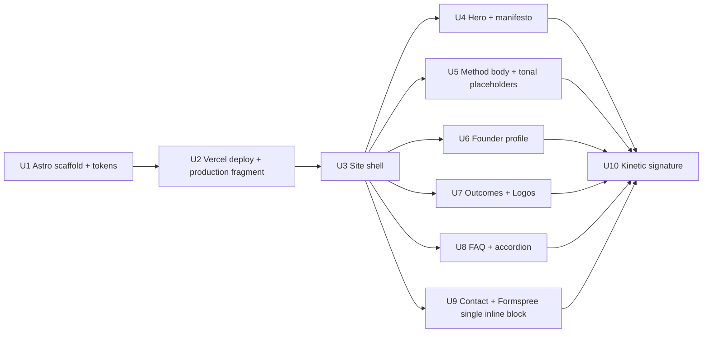

# feat: Capita Technology editorial redesign

## Summary

Migrate `capitatech-web` from vanilla static HTML to an Astro 6.2 + Tailwind 4 single-page editorial layout. Stack file shape mirrors the recent `cavaro-landingpage-web` project (single `Layout.astro` + `index.astro` + `global.css`, `@theme inline` design tokens, `prefers-reduced-motion` two-layer guard) but capita explicitly diverges on three points: it uses `<script is:inline>` (verbatim inlining) rather than Cavaro's processed `<script>`, it adds Inter via `@fontsource-variable/inter` as a fresh dependency (Cavaro doesn't ship Inter), and it does not inherit Cavaro's `html { font-size: 200% }` rem-doubling rule. New page architecture: manifesto-opening hero, four-part method body with tonal illustration placeholders, founder profile, restyled Outcomes/FAQ/Logos/Contact, plus a recurring kinetic-phrase signature at section breaks. Hosting moves off GitHub Pages to Vercel; site builds as static (`output: 'static'`, no adapter) and auto-deploys on git push.

---

## Problem Frame

The current `capitatech.com.au` does the basic lead-gen job but reads as generic B2B advisory — restrained, conservative, hard to distinguish from the average consultancy landing page. Capita serves senior execs in regulated industries (telco, banking, insurance, property, SaaS) who screen for craft and seniority within seconds. Boutique competitors at this tier ship with editorial polish the current site does not match. See origin for the full pain narrative and audience framing.

---

## Plan-Time Concerns (FYI)

Document review surfaced premise challenges that go back to brainstorm scope, not plan execution. Listed here so the user sees them; the plan inherits the brainstorm's resolutions and proceeds. Re-engage `ce-brainstorm` if any of these warrant revisiting before implementation.

- **"Premium feel as primary success axis" may optimize for designer reception, not buyer reception.** Senior execs in regulated industries typically screen for operator credibility, domain fit, social proof, and thesis specificity. Visual polish is hygiene, not a decision driver. The strongest counter-position is anonymized sector vignettes ("a Tier-1 telco; a major retail bank") with problem shape, diagnostic, recommendation, and measurement framework — which deliver seniority signals without naming clients. Brainstorm rejected case studies in any form; the anonymized-vignette path was not engaged.
- **Editorial idiom + kinetic typography may signal "design-forward boutique," not "senior advisory"** to the named audience. Boutique strategy peers typically present with restrained typography, dense (not sparse) information architecture, and named partners with named deliverables.
- **Stack migration (Astro + Tailwind + Vercel + fontsource) is not independently justified** by Capita's needs — it is driven by portfolio consistency with Cavaro. The visual redesign is achievable on the current vanilla stack with substantially less migration risk. Bundling the migration with the redesign is a sequencing choice, not a requirement.
- **Single-page architecture forecloses the most plausible 12–24-month expansion** (insights/thesis publishing, anonymized case sketches, sector intelligence). Astro itself is purpose-built for multi-page expansion; the foreclosure is the brainstorm's "single page retained" decision, not the framework.
- **Success criteria are largely unfalsifiable at ship time** — the buyer-perception criterion ("forms premium impression in first scroll") has no measurement plan; the founder-as-evaluator criterion is the only practical gate, which is prone to confirmation bias. No buyer-validation step (showing the redesigned page to 3–5 past prospects) is included.

These concerns are not addressed by editing the plan. They are surfaced for awareness before implementation begins.

---

## Requirements

Carried forward from `docs/brainstorms/2026-05-04-capita-editorial-redesign-requirements.md`. R-IDs match origin one-to-one so traceability is direct; this plan does not renumber.

**Layout and editorial system**

- R1. Single long-scroll landing page; no other pages introduced.
- R2. Editorial layout idiom: asymmetric, staggered, generous whitespace, alternating left/right alignment.
- R3. Dramatic type scale via `clamp()`-anchored size tokens; Inter remains body family. A paired display face is added during U4 if Inter alone fails the editorial-contrast gate (see U4).
- R4. Recurring kinetic phrase as section divider — exactly two mandatory occurrences (after hero, after founder); a third before contact is acceptable but not required.
- R5. Existing palette preserved exactly (`#ffffff`, `#0b0b0d`, `#4b4b57`, `#0078f0`, plus border/shadow tokens). A darker eyebrow tier (`#3a3a44` or similar) is added where 12–13px text against white needs WCAG AA on small sizes.
- R6. Rounded-pill / 12px-radius button idiom retained.
- R7. Sticky header with backdrop-blur retained, restyled to new type scale.

**Content sections (top-to-bottom)**

- R8. Hero with eyebrow + oversized H1 + 1–3-sentence manifesto + primary/secondary CTAs.
- R9. Method body: four asymmetric sections (assessment, strategy/architecture, roadmap, measurement/governance) each pairing prose with a tonal illustration placeholder block.
- R10. Founder profile section: photo placeholder, bio prose, signed manifesto line.
- R11. Outcomes preserved (retention lift, revenue protection, AI that performs); restyled.
- R12. FAQ preserved with single-open accordion behavior; restyled; full keyboard + ARIA.
- R13. Logo grid preserved; restyled.
- R14. Contact form preserved (validation, country picker, Formspree submission); restyled. The "Strict NDA / Security-first / No spam" trust-signal pill row is removed (positioning incompatible with premium-feel goal; see U9).
- R15. Footer structure preserved (contact / services / industries tiles + copyright + anchors); restyled.

**Stack and engineering**

- R16. Astro framework — file-shape inherited from `cavaro-landingpage-web` (single Layout/index/global.css), but with three explicit divergences: `<script is:inline>` (not processed `<script>`), `@fontsource-variable/inter` (fresh package; Cavaro ships different fonts), no `html { font-size: 200% }` rule (Cavaro's root-rem doubling is not adopted).
- R17. JS behaviors preserved: HTTPS redirect, FAQ accordion, country code picker (type-ahead, AU default), form validation, Formspree submission to `https://formspree.io/f/xojdzarv`. All ported as a single inline `<script is:inline>` block at end-of-body in `index.astro` (HTTPS redirect is the exception — it lives in `<head>` so it runs before paint).
- R18. Static build output; no server runtime.

**Accessibility, responsive, performance**

- R19. Skip link, ARIA landmarks, keyboard FAQ, accessible labels preserved or improved. `scroll-margin-top` set to header height on every anchor target so iOS Safari sticky-header occlusion is avoided. Form inputs minimum tap target 44px height. Kinetic phrase `<div>` is `aria-hidden="true"` so screen readers don't loop the marquee. `--muted` body text passes WCAG AA at 4.6:1; eyebrow tier (`#3a3a44`) added for small sizes.
- R20. Single-column responsive collapse; `prefers-reduced-motion` honored (CSS rule + JS guard rail). Mobile primary nav stays hidden at `≤840px` (current behavior) with the CTA pill remaining accessible — scroll-only navigation is the explicit decision; hamburger is deferred unless user testing demands it.
- R21. **LCP target: ≤ 2.5s on Lighthouse mobile (slow 4G throttling, p75 of 5 runs).** This is an absolute Web Vitals "good" threshold, not a relative budget. Baseline measurement of the current `https://capitatech.com.au` LCP is captured before U1 begins (recorded in `README.md` as a reference number) but the gate is the absolute target, not the +10% relative budget. The relative budget was unenforceable without specifying methodology.
- R22. Tonal illustration placeholders are pure CSS (no ``), so they cannot block render or generate network requests.

**Origin actors:** A1 (Prospect — senior exec evaluating fit in under a minute).
**Origin acceptance examples:** AE1 (kinetic phrase ≥2 occurrences), AE2 (illustration TBD placeholder), AE3 (FAQ keyboard + ARIA), AE4 (Formspree submission contract), AE5 (`prefers-reduced-motion` static fallback).

---

## Scope Boundaries

- Color palette changes — current palette preserved exactly, except for adding one darker eyebrow tier (`#3a3a44`) for AA contrast on small text.
- Multi-page architecture (`/work`, `/about`, `/insights`, `/contact`) — not introduced.
- Case studies in any form (named, anonymized, composite).
- Real custom illustration artwork — placeholders only.
- Real founder photography — placeholder only.
- Blog or insights content stream.
- Lead-gen logic rebuild — form behavior, country picker logic, Formspree endpoint preserved (only ported to Astro idioms).
- Server-side API routes — Formspree continues as direct browser `fetch`.
- CMS introduction.
- Analytics rebuild — current setup (none observed beyond browser-default) is not changed.
- Reverse-engineering humanlyagile.com's exact CSS — the reference is the editorial idiom, not a clone.
- Tailwind 5, Astro 7, Node major upgrades during this redesign.
- Cavaro's `@astrojs/vercel` adapter — capitatech-web has no SSR endpoints, so the adapter is intentionally not adopted (static output covers it).
- Cavaro's `html { font-size: 200% }` rem-doubling rule — capitatech-web uses default 16px root.
- Trust-signal pill row in contact section — removed (incompatible with premium positioning for senior buyers).
- Hamburger mobile nav — not introduced in v1; scroll-only nav at `≤840px` matches current behavior.

### Deferred to Follow-Up Work

- Capturing this redesign's institutional learnings post-ship through the team's documentation workflow. Items worth capturing: the Astro + Vercel migration from GitHub Pages, the `<script is:inline>` decision and its single-block scope rules, the Formspree direct-from-browser pattern in Astro, and the tonal-placeholder pattern. Capture is out of plan scope.
- Dark-mode treatment. Origin did not request it; existing site has no dark-mode tokens.
- Replacing the placeholder illustrations with real artwork — sourced and dropped in by the founder after v1 ships. The tonal placeholder block uses `aspect-ratio: 4/3`; the founder's commissioned artwork should match this ratio or the placeholder ratio adjusts at the swap-in (one-line CSS edit).
- Replacing the founder photo placeholder with a real photo (square, `aspect-ratio: 1/1`).
- Hamburger nav for mobile if user testing reveals scroll-only navigation hurts engagement.
- Any buyer-validation step (showing the redesigned page to 3–5 past prospects for reaction). Not included in v1; flagged as an FYI.

---

## Context & Research

### Relevant Code and Patterns

- `index.html` (current site) — source of all preserved content (eyebrow, H1, lede, outcomes, FAQ Q&A pairs, footer tiles, contact-form structure, country picker dataset).
- `styles.css` (current site) — palette tokens, sticky header pattern, button/pill idiom, FAQ `+`/`−` accordion icon treatment, logo-grid responsive pattern. All carry forward as values; CSS itself is replaced by Tailwind 4 + `@theme inline` tokens in `src/styles/global.css`.
- `logos/logo-01.png` … `logos/logo-08.png` — existing client logos (hyphenated). Move to `public/logos/`. Unhyphenated duplicates `logo1.png`–`logo8.png` and the `fonts/NotoSans*.ttf` directory are stale and deleted.
- `CNAME` — GitHub Pages-specific. Delete during Vercel migration.
- Existing inline `<script>` in `index.html` — HTTPS redirect, FAQ accordion (single-open), country picker type-ahead with 27-country dataset, form validation hardening (control-character stripping, length caps, honeypot), Formspree POST. Each block ports to a single Astro `<script is:inline>` block at end-of-body in `index.astro`.

### Cross-Repo Reference

- `cavaro-landingpage-web/` (sibling repo at `~/Documents/GitHub/cavaro-landingpage-web/`) — the Astro project this plan inherits **file shape** from. Specifically:
  - `package.json` — Astro 6.2.x, `@tailwindcss/vite` 4.2.x, `tailwindcss` 4.2.x, `@astrojs/check`, TypeScript 6, Node ≥22.12, pnpm. **Do NOT copy `@astrojs/vercel`** — capitatech is static-only. **Inter is added separately** (`@fontsource-variable/inter`); Cavaro ships `@fontsource-variable/stack-sans-notch` and `@fontsource/coral-pixels` instead, so the fontsource dependency is not inherited verbatim — only the import pattern is.
  - `astro.config.mjs` — Tailwind via Vite plugin pattern. Reuse the `tailwindcss()` Vite plugin; replace the `adapter: vercel()` line with no adapter (static output).
  - `src/layouts/Layout.astro` — fontsource imports in frontmatter, `<head>` meta + font + CSS layout. Mirror the file shape; swap font imports for Inter.
  - `src/pages/index.astro` — single-page hero. **Capitatech diverges**: Cavaro uses default `<script>` (Vite-processed, type-checked, hoisted as a chunk); capitatech uses `<script is:inline>` (verbatim inlining, no processing) so behaviors port without bundler timing changes and there is genuinely no extra `.js` chunk request. The "inline scripts" framing in capitatech's plan refers to `is:inline`, not Cavaro's pattern.
  - `src/styles/global.css` — `@theme inline` design tokens block, `clamp()` responsive token strategy, `prefers-reduced-motion` rule. Mirror the structure; replace token values with Capita's palette and editorial type scale. **Do not inherit** Cavaro's `html { font-size: 200% }` root rule — capitatech uses default 16px root so Tailwind utilities scale predictably.
  - `src/types.d.ts` — fontsource module declarations. Cavaro's declarations name different fontsource packages; capitatech declares `@fontsource-variable/inter/wght.css` instead.
  - `cavaro-landingpage-web/docs/plans/2026-05-04-001-feat-cavaro-chunky-redesign-plan.md` — sibling plan with reusable patterns: cross-breakpoint acceptance gates table structure, performance budget itemization method, `prefers-reduced-motion` two-layer pattern, `clamp()` token strategy. Path is in the Cavaro repo, not capitatech.

### Institutional Learnings

- No `docs/solutions/` tree exists yet in `capitatech-web`. The Cavaro plan is the closest available institutional reference for file shape and token strategy, but the script-mode decision (`is:inline` vs processed) and the Inter package are capitatech-specific choices.
- `<script is:inline>` blocks in Astro are inlined verbatim into the prerendered HTML with no Vite processing, no TypeScript checking, no bundler chunk emission, and no client directives applied — so behaviors execute synchronously during HTML parsing exactly like a vanilla `<script>` tag in a hand-written `index.html`. This is the property capitatech needs to preserve no-runtime, no-extra-request behavior. Default Astro `<script>` (no directive) is the opposite mode: hoisted, bundled, type-checked, emitted as a separate chunk.
- `@fontsource-variable/inter/wght.css` ships variable-weight axis files for every language subset gated by `unicode-range`; the browser only fetches latin at runtime for English content (~30 KB), but Vite still emits the other-subset files into `_astro/`. Verification language for U1 is "browser fetches latin only," not "only latin emitted to disk."

### External References

- humanlyagile.com — editorial idiom reference (asymmetric staggered sections, dramatic type scale, kinetic repetition, generous whitespace). Read at brainstorm time; not re-fetched during planning.
- Astro static output documentation — confirms `output: 'static'` is the default; Vercel auto-detects Astro and runs `astro build` on push. Detection requires a recognizable lockfile (pnpm-lock.yaml) and Node version compatible with Astro 6.2. U2 verifies these explicitly.
- `animation-timeline: view()` — supported in Chrome 115+, Edge 115+, Safari 17.4+, Firefox 142+ as of 2026-05. Most evergreen browsers see the scroll-driven path. Marquee fallback covers older browsers; `prefers-reduced-motion` collapses both to static. Marquee element gets `aria-hidden="true"` so screen readers don't loop-announce.

---

## Key Technical Decisions

- **Astro static output, no adapter.** The current site is fully static and Formspree handles form submissions externally. `@astrojs/vercel` is unnecessary and would only add capability we don't use. `astro build` emits to `dist/`, Vercel serves it.
- **Tailwind 4 via `@tailwindcss/vite` plus `@theme inline` token block in `global.css`.** Inherits the Cavaro file shape. Tokens (palette, type scale, radius, spacing, kinetic phrase sizing) live in one place; component styles use Tailwind utilities. No PostCSS config, no `tailwind.config.js`. **Do not inherit Cavaro's `html { font-size: 200% }` root rule** — capitatech keeps default 16px root.
- **Inter via `@fontsource-variable/inter` (wght axis, latin subset) — fresh package, not inherited from Cavaro.** Cavaro ships different fontsource packages; only the *import pattern* (frontmatter import in `Layout.astro`, type declaration in `types.d.ts`) is inherited. Rationale for self-hosting Inter (vs. current Google Fonts CDN): privacy (no third-party fingerprinting), resilience (no third-party dependency in the request path), origin-control (cached on the same Vercel edge as the HTML), and consistency (no version drift). The "removes a network round-trip" framing was incorrect — Google Fonts with `<link rel="preconnect">` already collapses the handshake; the win is privacy/control, not speed. `--font-display` token added but defaults to `var(--font-sans)`; a paired display face is added at U4 if the editorial-contrast gate fails (see U4).
- **All existing JS behaviors port as a single `<script is:inline>` block at end-of-body in `index.astro`, plus a separate `<script is:inline>` in `<head>` for the HTTPS redirect.** This mirrors the current `index.html` structure (HTTPS redirect in head, everything else at end-of-body). `is:inline` is verbatim inlining — no Vite processing, no bundler chunk, no module scope. This diverges from Cavaro's processed-script pattern but matches capitatech's no-runtime-overhead requirement. Single-block consolidation (vs. three split blocks) avoids cross-block scope ambiguity for IIFE-wrapped helpers (`stripControls`, `normalizeSpaces`, etc.).
- **Kinetic typography uses scroll-driven CSS animation with a marquee fallback.** `animation-timeline: view()` triggers on the kinetic phrase entering the viewport; `@supports (animation-timeline: view())` gates the modern path. Without `@supports` support (or in `not` branch) the page falls back to a horizontal CSS marquee using `@keyframes` + `transform: translateX()`. Both paths fold under a single `prefers-reduced-motion: reduce` rule that pins the phrase static. Marquee `<div>` carries `aria-hidden="true"` so screen readers don't loop-announce. Static states: phrase enters the viewport with opacity 0 / translateY(20px), animates to opacity 1 / translateY(0) as it crosses the viewport center, holds full visibility through scroll, fades back to opacity 0 as it exits the viewport top. Marquee version is continuously visible, animating horizontally.
- **`prefers-reduced-motion` enforced in two layers per Cavaro pattern.** CSS rule `@media (prefers-reduced-motion: reduce)` collapses all motion (kinetic phrase static, button hover transforms removed). Inline `<script>` reads `window.matchMedia('(prefers-reduced-motion: reduce)').matches` once and short-circuits any future JS-driven motion. The script half is a guard rail more than an active code path in v1.
- **Illustration placeholder is a tonal block, not a dashed-outline.** `<div>` with `aspect-ratio: 4/3`, `--radius-md`, a low-contrast tonal fill (`background: color-mix(in srgb, var(--text) 4%, var(--bg))` or similar — implementer tunes to read as "intentional negative space" not "missing image"). No caption text. `aria-hidden="true"`. Reads as deliberate composition, not wireframe artifact, until artwork lands.
- **Founder photo placeholder uses the same tonal-block treatment** with `aspect-ratio: 1/1`. Caption "Founder photo" appears below the block as figure-caption text (not inside the block). When real photo lands, becomes `` and the caption stays.
- **Asymmetric column ratios for editorial blocks.** Method blocks use `grid-template-columns: 1.4fr 0.6fr` (content-dominant, placeholder narrower). Alternating left/right per block flips the column order, not the ratio — placeholder stays the narrower column throughout for visual rhythm. Founder section uses `0.4fr 0.6fr` (photo narrower, bio wider). 1fr/1fr was reviewed and rejected as visually too symmetric for the editorial idiom.
- **Trust-signal pills removed from contact section.** "Strict NDA / Security-first / No spam" reads as SaaS anxiety-reducer aimed at SMB cold-outbound buyers, not at the senior-exec audience the redesign targets. NDA preference can be raised on the discovery call instead.
- **`scroll-margin-top` token applied to every anchor target.** iOS Safari sticky-header anchor occlusion is a known issue; `scroll-margin-top: var(--header-height)` on `#outcomes`, `#faq`, `#contact` (and any other anchor targets) ensures the header doesn't cover the section heading after a scroll-jump.
- **Mobile nav stays scroll-only at `≤840px`.** Primary nav links collapse (current behavior); CTA pill remains accessible. Hamburger pattern not introduced in v1.
- **Form continues posting directly from browser to Formspree.** No Astro API route introduced; existing client-side validation + POST contract preserved.
- **Existing logos move to `public/logos/`.** Astro's `public/` directory is served as-is from the deployment root. Hyphenated filenames preserved exactly (`logo-01.png` … `logo-08.png`); unhyphenated duplicates and the `fonts/NotoSans*.ttf` directory are stale and deleted in U1.
- **`CNAME` file deleted** as part of U2 Vercel cutover.
- **Founder copy is a hard gate on U4, U6, U10 — not a "ship with placeholder, swap later" decision.** The success criteria require the page to read as premium on first scroll, which placeholder copy cannot satisfy. The hero manifesto, four method-section prose blocks, founder bio, signed manifesto line, and recurring kinetic phrase must all be approved by the founder before their corresponding units sign off. Placeholder copy may be used during *visual prototyping* but production deployment gates on real copy.
- **Phasing: foundation+deploy before visuals.** U1 + U2 confirm the new stack ships through to the live domain before any time is spent on editorial composition. U2 verification includes a production-grade fragment (Tailwind-styled hero + HTTPS redirect inline script + a single fontsource-loaded font) so the deploy verification exercises Tailwind production minification and fontsource path resolution under Vite production mode, not just an empty Astro page.

---

## Open Questions

### Resolved During Planning

- **Astro adapter choice?** No adapter; static output (`output: 'static'`).
- **Tailwind 4 vs vanilla CSS?** Tailwind 4 + `@theme inline` block.
- **Hosting target?** Vercel.
- **Font hosting?** Self-host via `@fontsource-variable/inter`. Rationale: privacy / origin-control / resilience (not speed; speed claim was incorrect).
- **Where do existing JS behaviors live in Astro?** Single `<script is:inline>` block at end-of-body in `index.astro`, plus separate `<script is:inline>` in `<head>` for HTTPS redirect.
- **Default `<script>` vs `<script is:inline>`?** `is:inline` everywhere. Diverges from Cavaro's processed-script pattern but matches capitatech's no-runtime-overhead requirement.
- **Should we inherit Cavaro's `html { font-size: 200% }`?** No. Capitatech uses default 16px root.
- **Kinetic typography technique?** Scroll-driven CSS animation (`animation-timeline: view()`) with `@supports`-gated marquee fallback, fully overridden under `prefers-reduced-motion`. Marquee element is `aria-hidden="true"`.
- **Illustration placeholder shape?** Tonal block, no caption inside, `aria-hidden`. Founder photo placeholder uses same treatment with caption below the block.
- **Asymmetric column ratios?** Method blocks `1.4fr / 0.6fr` (placeholder narrower); founder section `0.4fr / 0.6fr` (photo narrower).
- **Mobile nav?** Scroll-only at `≤840px`; hamburger deferred.
- **Trust-signal pills in contact?** Removed.
- **LCP target?** Absolute Web Vitals "good" threshold (≤ 2.5s on Lighthouse mobile slow-4G p75 of 5 runs), not relative +10%. Current site LCP measured before U1 begins for reference but not used as the gate.
- **Founder copy timing?** Hard gate on U4, U6, U10 — placeholder for visual prototyping only, real copy required for ship.

### Deferred to Implementation

- **Exact `clamp()` ranges for editorial type scale.** Tune live across the 5 reference viewports. H1 floor must produce ≥3-line wrap acceptable at 320×568; ceiling must not grow past comfortable measure at 1920×1080.
- **Whether to add a paired display face at U4.** Hard gate: if H1 at the editorial scale does not produce perceivable contrast against Inter body type, U4 cannot ship without adding a second `@fontsource-variable/*` package and pointing `--font-display` at it. Implementer makes the call during visual prototyping and updates the plan.
- **Specific recurring kinetic phrase wording, manifesto wording, founder bio copy, signed manifesto line, method-section prose.** Founder authors all of this. Plan reserves structural slots; production ship gates on real copy.
- **Whether the country picker dataset needs trimming or expansion.** Current 27-country list ports as-is per origin scope; if implementer notices a target market missing (e.g., Hong Kong for SaaS), surface as a follow-up.
- **Vercel project name and team scope.** User decides at deploy time when adding the project to Vercel dashboard.
- **Whether to optionally add a third kinetic-phrase occurrence before contact.** Decide live during U10 — is three repetitions composed or repetitive? Default to two.

---

## Output Structure

```
capitatech-web/
├── .gitignore                              (modify — add Astro outputs)
├── README.md                                (modify — Astro setup notes + LCP baseline)
├── package.json                             (create)
├── pnpm-lock.yaml                           (create — auto-generated)
├── tsconfig.json                            (create)
├── astro.config.mjs                         (create)
├── public/
│   └── logos/
│       └── logo-01.png  …  logo-08.png      (move from repo root /logos/)
├── src/
│   ├── layouts/
│   │   └── Layout.astro                     (create)
│   ├── pages/
│   │   └── index.astro                      (create — replaces root index.html)
│   ├── styles/
│   │   └── global.css                       (create — replaces root styles.css)
│   └── types.d.ts                           (create — fontsource module declarations)
├── docs/
│   ├── brainstorms/
│   │   └── 2026-05-04-capita-editorial-redesign-requirements.md  (existing)
│   └── plans/
│       └── 2026-05-04-001-feat-capita-editorial-redesign-plan.md  (this file)
├── (deleted) CNAME                          (GH Pages-specific; gone after Vercel migration)
├── (deleted) index.html                     (replaced by src/pages/index.astro)
├── (deleted) styles.css                     (replaced by src/styles/global.css)
├── (deleted) logos/                         (hyphenated 8 moved to public/logos/; unhyphenated logo1.png–logo8.png are stale duplicates and deleted)
└── (deleted) fonts/                         (NotoSans*.ttf; unreferenced by current site, dead code)
```

The implementer may adjust this layout if implementation reveals a better structure; per-unit `**Files:**` sections remain authoritative.

---

## High-Level Technical Design

> *This illustrates the intended approach and is directional guidance for review, not implementation specification. The implementing agent should treat it as context, not code to reproduce.*

**Page architecture** (vertical sections, top-to-bottom):

```
┌─────────────────────────────────────────────────────────────┐
│  <header>  sticky, backdrop-blur, brand mark + nav          │
├─────────────────────────────────────────────────────────────┤
│  <main>                                                     │
│    ┌─ HERO ──────────────────────────────────────────────┐ │
│    │  eyebrow · oversized H1 · manifesto (1–3 sentences) │ │
│    │  primary + secondary CTAs                           │ │
│    │  logo grid (existing 8 client logos, restyled)      │ │
│    └─────────────────────────────────────────────────────┘ │
│    ── kinetic phrase divider (occurrence 1: mandatory) ──   │
│    ┌─ METHOD ────────────────────────────────────────────┐ │
│    │  4 asymmetric blocks (1.4fr / 0.6fr alternating):   │ │
│    │    assessment · strategy · roadmap · measurement    │ │
│    │  each: heading + prose + tonal placeholder block    │ │
│    └─────────────────────────────────────────────────────┘ │
│    ── kinetic phrase divider (occurrence 2: mandatory) ──   │
│    ┌─ FOUNDER ───────────────────────────────────────────┐ │
│    │  tonal photo placeholder · bio prose · signed line  │ │
│    └─────────────────────────────────────────────────────┘ │
│    ┌─ OUTCOMES ──────────────────────────────────────────┐ │
│    │  3-card grid (retention, revenue, AI), restyled     │ │
│    └─────────────────────────────────────────────────────┘ │
│    ┌─ FAQ ───────────────────────────────────────────────┐ │
│    │  5 questions, single-open accordion + side tile     │ │
│    └─────────────────────────────────────────────────────┘ │
│    ── kinetic phrase divider (occurrence 3: optional) ──    │
│    ┌─ CONTACT ───────────────────────────────────────────┐ │
│    │  form · country picker · pain tile                  │ │
│    │  (no trust-signal pill row — removed)               │ │
│    └─────────────────────────────────────────────────────┘ │
│  </main>                                                    │
├─────────────────────────────────────────────────────────────┤
│  <footer>  3 tiles + copyright + anchor links               │
│  (year-stamp <script is:inline> sits AFTER footer markup)   │
└─────────────────────────────────────────────────────────────┘
```

**Implementation phasing** (dependencies):



**Inline-script structure inside `index.astro`** (single block, end-of-body):

```
<head>:
  <script is:inline>
    HTTPS redirect (runs before paint)
  </script>

<body>:
  ...all markup including <header>, <main>, <footer>...

  <script is:inline>
    // single block at end-of-body, runs after DOM parsed
    1. Year stamp injection (footer copyright)
    2. Hardening helpers (stripControls, normalizeSpaces, safeBodyText, isValidName, isValidEmail, isValidPhoneLocal, iso2ToFlag)
    3. FAQ accordion handler (single-open, ARIA toggle)
    4. Country picker (type-ahead, 27-country dataset, default AU, click-outside-to-close)
    5. Form validate + Formspree POST
  </script>
```

Helpers are declared at the top of the single block (not wrapped in IIFEs) so they're in scope for the FAQ, picker, and form handlers below. Each behavior body (FAQ, picker, form) wraps in its own IIFE for isolation.

---

## Cross-Breakpoint Acceptance Gates

Before any **visual** unit's verification step is signed off (U3–U10), the rendered page must pass these gates at every reference breakpoint. Treat failures as P1. Build/typecheck-only units (U1, U2) use unit-specific verification.

Reduced from 8 viewports to 5 — origin requirements cover ~4 distinct responsive states; landscape-mobile, landscape-tablet, and ultrawide were imported from Cavaro and produce verification overhead without proportionate coverage.

| Breakpoint | Viewport (W × H) | Gates |
|---|---|---|
| Mobile S | 320 × 568 | No horizontal scroll. Hero H1 wraps without orphan-line CTA (≤4 lines acceptable, font-size floor produces readable but not overwhelming H1). Method blocks stack vertically. Form input + button at 44px tap target. Kinetic phrase fits or marquees within viewport. Anchor-link jumps land below sticky header (`scroll-margin-top` works). |
| Mobile | 375 × 812 | Reference target. All sections single-column. CTAs full-width. FAQ accordion taps work. Country picker list opens within viewport (constrained `max-height` if needed). Color contrast on `--muted` and eyebrow tier passes WCAG AA. |
| Tablet | 768 × 1024 | Method blocks begin asymmetric (1.4fr/0.6fr). Outcomes 3-card grid collapses to 2-up or 1-up gracefully. Footer 3 tiles stack to 1-up. Header sticky behavior smooth. |
| Desktop | 1280 × 800 | Reference target. All editorial idioms at intended expression: dramatic type scale, generous whitespace, asymmetric blocks alternating side. Display-face contrast vs body type readable as "premium" (gates U4 paired-face decision). |
| Wide | 1920 × 1080 | Container max-width caps at `var(--container)`; whitespace breathes. Hero text doesn't grow past comfortable measure. Method blocks remain content-dominant. |

Manual visual passes are required; build/typecheck do not catch composition issues. Lighthouse mobile + desktop runs are advisory but not sufficient.

---

## Implementation Units

### Phase 1 — Foundation + Deploy

- U1. **Astro 6.2 + Tailwind 4 scaffold and design tokens**

**Goal:** Bring up an Astro project skeleton at the repo root with Tailwind 4 wired via the Vite plugin, design tokens registered in `@theme inline`, the existing palette ported plus the new eyebrow tier, Inter loaded via fontsource-variable as a fresh dependency, and a placeholder `index.astro` that renders without errors. Capture the current site's LCP baseline in `README.md` for reference. Dev server runs (`astro dev`) and `astro build` emits `dist/index.html`.

**Requirements:** R3, R5, R16, R18, R21

**Dependencies:** none

**Files:**
- Create: `package.json`
- Create: `pnpm-lock.yaml` (auto-generated by `pnpm install`)
- Create: `tsconfig.json`
- Create: `astro.config.mjs`
- Create: `src/layouts/Layout.astro`
- Create: `src/pages/index.astro` (placeholder — minimal markup, no behaviors yet)
- Create: `src/styles/global.css`
- Create: `src/types.d.ts`
- Modify: `.gitignore` (add `node_modules/`, `dist/`, `.astro/`, `.vercel/`)
- Modify: `README.md` (Astro setup notes + LCP baseline measurement value)
- Delete: `logos/logo1.png` … `logos/logo8.png` (unhyphenated duplicates, stale)
- Delete: `fonts/NotoSans-Regular.ttf`, `fonts/NotoSans-SemiBold.ttf`, then `fonts/` directory (unreferenced, dead code)

**Approach:**
- **Mirror Cavaro's `package.json` versions for the shared deps**: `astro ^6.2.1`, `@tailwindcss/vite ^4.2.4`, `tailwindcss ^4.2.4`, `@astrojs/check ^0.9.9`, `typescript ^6.0.3`, `@types/node ^25.6.0`. **Add `@fontsource-variable/inter` as a fresh dependency** — verify the latest published major version on npm before pinning (likely ^5.x but confirm the actual version and the existence of `wght.css` at the import path). **Do NOT add `@astrojs/vercel`**.
- `astro.config.mjs`: import `tailwindcss` from `@tailwindcss/vite`, register as a Vite plugin, no `adapter` field, no `output` override (default static).
- `src/styles/global.css`: top of file is `@import "tailwindcss"`. Then a `@theme inline { … }` block declaring CSS custom properties for the Capita palette (`--bg #ffffff`, `--text #0b0b0d`, `--muted #4b4b57`, `--muted-strong #3a3a44` for eyebrows on small text, `--accent #0078f0`, plus border/shadow tokens). Type tokens (`--font-sans` Inter, `--font-display` defaulting to `var(--font-sans)`), radius/container/padding tokens currently in `styles.css`, and a kinetic-phrase size token via `clamp()`. **Do NOT add `html { font-size: 200% }`** — capitatech keeps default 16px root.
- `src/layouts/Layout.astro` frontmatter imports `@fontsource-variable/inter/wght.css` and `../styles/global.css`. The `<head>` carries meta description, viewport, the existing `<title>` ("Capita Technology"), and a self-contained `<script is:inline>` block with the HTTPS redirect logic ported from current `index.html` lines 13-23.
- `src/types.d.ts`: declare `@fontsource-variable/inter/wght.css` so TypeScript doesn't complain about the CSS import.
- `src/pages/index.astro` is a minimal placeholder for this unit — `<Layout>` wrapper, an `<h1>` reading "Capita Technology", a `<p>` lede. Visual implementation lands in U4. Goal is to verify the build pipeline produces a valid `dist/index.html`.
- **Capture LCP baseline**: run `npx lighthouse https://capitatech.com.au --only-categories=performance --form-factor=mobile --quiet --preset=perf` (or equivalent), record the LCP value in `README.md` under "Performance baseline (pre-redesign)". This number is reference-only; the gate is the absolute target in R21.

**Patterns to follow:**
- `cavaro-landingpage-web/package.json` — version pin for shared deps (NOT for fontsource Inter)
- `cavaro-landingpage-web/astro.config.mjs` — Tailwind via Vite plugin pattern (drop the `vercel()` adapter line)
- `cavaro-landingpage-web/src/styles/global.css` — `@theme inline` token block structure (NOT the `html { font-size: 200% }` rule)
- `cavaro-landingpage-web/src/layouts/Layout.astro` — fontsource frontmatter import pattern + `<head>` shape
- `cavaro-landingpage-web/src/types.d.ts` — fontsource module declaration pattern (with package name swapped to `@fontsource-variable/inter/wght.css`)

**Test scenarios:**
- Happy path: `pnpm install` succeeds and lockfile is generated.
- Happy path: `pnpm dev` starts the dev server and serves the placeholder page.
- Happy path: `pnpm build` completes without errors and emits `dist/index.html` plus `dist/_astro/*.css`.
- Happy path: `pnpm check` (Astro typecheck) passes.
- Happy path: `dist/index.html` opens with Inter rendering correctly (no FOUC, no fallback flash).
- Edge case: clean clone + `pnpm install` from a fresh checkout reproduces the lockfile.
- Edge case: `--muted` (`#4b4b57`) on white passes WCAG AA at 4.6:1; `--muted-strong` (`#3a3a44`) at small sizes passes AA. Verify with a contrast-checker.
- Edge case: Tailwind utilities scale predictably (1rem = 16px), confirming the absence of Cavaro's 200% rule.
- Test expectation: integration test for the build pipeline is `pnpm build` succeeding; no unit tests.

**Verification:**
- Dev server runs and renders the placeholder Layout + index.
- `pnpm build` produces a working static `dist/`.
- `pnpm check` reports no errors.
- Browser DevTools confirms Inter is fetched from a self-hosted asset (path under `/_astro/`), not Google Fonts.
- LCP baseline value recorded in `README.md`.
- `logos/logo1.png`–`logo8.png` and `fonts/` directory are deleted from the repo.

---

- U2. **Vercel deploy pipeline + DNS migration + production-fragment verification**

**Goal:** Connect the repo to a Vercel project, confirm a preview deploy of a production-grade fragment (Tailwind-styled hero + HTTPS redirect inline script + fontsource-loaded Inter, not just the U1 placeholder) resolves at the Vercel-assigned URL, snapshot existing DNS records, attach `capitatech.com.au` as the production domain, update DNS at the registrar, and confirm production resolves to the new build with email forwarding intact. Delete the GitHub Pages `CNAME` file as part of the migration.

**Requirements:** R18

**Dependencies:** U1

**Files:**
- Delete: `CNAME` (GitHub Pages-specific; not used on Vercel)
- Create: `vercel.json` — likely needed only if pnpm detection or Node version requires explicit config; create only if first deploy fails.
- Modify: `README.md` (deploy + DNS notes for future maintainers; record the captured DNS snapshot)
- Modify: `src/pages/index.astro` (replace U1 placeholder with a production-grade fragment: a Tailwind-styled `<h1>` using the editorial type scale token and the fontsource-loaded Inter, plus a comment marking "U2 verification fragment — replaced in U3-U4")

**Approach:**
- **Pre-cutover DNS snapshot (operational, before any DNS change):**
  1. `dig capitatech.com.au A`, `dig capitatech.com.au MX`, `dig capitatech.com.au TXT`, `dig capitatech.com.au NS` against the live domain. Capture all output in `README.md` under "DNS snapshot (pre-Vercel migration)".
  2. Identify the registrar in use. Confirm whether the registrar supports apex `A` records (required for Vercel) or apex `ALIAS`/`ANAME` (also acceptable).
  3. Send a test email to `consulting@capitatech.com.au` from an external account. Confirm receipt. Capture the receipt timestamp.
- **Vercel project setup (operational):**
  1. Create a Vercel project linked to the `capitatech-web` repo. Verify Vercel auto-detects Astro (framework preset), pnpm (from `pnpm-lock.yaml`), and Node ≥22.12 (from `package.json` `engines`).
  2. If Vercel's auto-detection picks the wrong Node version or the wrong package manager, create `vercel.json` with explicit `installCommand: "pnpm install --frozen-lockfile"`, `buildCommand: "pnpm build"`, and configure Node version in the project's General settings (Vercel dashboard).
  3. First push to a non-main branch triggers a preview deploy at a Vercel-assigned URL. Verify the production-grade fragment from `index.astro` renders correctly: Inter loads from `/_astro/`, Tailwind CSS minifies and serves correctly, HTTPS redirect script is present in the served HTML. **This is the production-toolchain verification gate** — not just "an empty Astro page deployed."
  4. Add `capitatech.com.au` (and `www.capitatech.com.au` if used) as production domains in the Vercel project dashboard. Vercel issues SSL via Let's Encrypt. If a CAA record on the apex blocks Let's Encrypt, surface this and resolve at the registrar before continuing.
  5. At the domain registrar, update DNS records per Vercel's instructions (typically apex `A` to Vercel's anycast IP, `CNAME` for `www` to `cname.vercel-dns.com`). **Do not modify `MX` or `TXT` records.** Capture the post-change DNS state in `README.md`.
  6. After DNS propagation (`dig` confirms Vercel IPs at the apex), send a second test email to `consulting@capitatech.com.au`. Confirm delivery. If it fails, **execute rollback** (next bullet).
- **DNS rollback procedure (documented; executed only on failure):**
  1. At the registrar, restore the pre-migration `A` and `CNAME` records from the snapshot in `README.md`.
  2. Wait for propagation (up to 48h depending on TTL).
  3. Re-add `CNAME` file at repo root (`capitatech.com.au`), recommit, push to main.
  4. Confirm `capitatech.com.au` resolves to GitHub Pages and serves the original site.
  5. Resolve the underlying issue (whatever broke email forwarding or content delivery) before retrying.
- **`CNAME` deletion**: only after 7 consecutive days of stable Vercel-served traffic post-cutover. Until then, leave `CNAME` and the original `index.html`/`styles.css` in place at the repo root as a quick-revert fallback (they are dead code from Vercel's perspective but provide rollback optionality).

**Patterns to follow:**
- `cavaro-landingpage-web` Vercel deploy as a live reference for what a working setup looks like (project settings, domain config). Note that Cavaro uses the `@astrojs/vercel` adapter; capitatech uses static output instead, so the Vercel project's framework preset behavior may differ. Verify accordingly.

**Test scenarios:**
- Happy path: pushing to a non-main branch triggers a Vercel preview deploy with a unique URL; the URL renders the production-grade fragment with Tailwind styles and Inter font.
- Happy path: after DNS propagation, `https://capitatech.com.au` returns the Vercel-served build with valid SSL.
- Happy path: `https://www.capitatech.com.au` resolves to the same content or 301-redirects to the apex (whichever matches Capita's preference).
- Edge case: Vercel auto-detection picks `npm` instead of `pnpm` — surfaces as a build failure during preview deploy. Resolution: add `vercel.json` with explicit `installCommand`.
- Edge case: Vercel runs Node 20 instead of Node 22.12 — surfaces as a build failure or runtime error. Resolution: set Node version in Vercel project's General settings.
- Edge case (rollback): test email to `consulting@capitatech.com.au` post-cutover does not arrive within 30 minutes. Execute DNS rollback per the documented procedure.
- Edge case: HTTP → HTTPS redirect works at the platform layer (Vercel does this by default), independent of the in-page HTTPS redirect script.
- Test expectation: no automated tests; verification is the operational checklist in `README.md`.

**Verification:**
- Preview URL renders the production-grade fragment with correct Tailwind output and Inter font.
- `capitatech.com.au` resolves to Vercel and serves the same content.
- SSL certificate is valid and auto-renewing.
- Test email post-cutover arrives in the founder's inbox within 30 minutes.
- DNS snapshot and rollback procedure are recorded in `README.md`.
- `CNAME`, `index.html`, `styles.css` remain in repo for 7 days post-cutover before deletion (quick-revert window).

---

### Phase 2 — Editorial Sections

- U3. **Site shell — sticky header + footer + scroll-margin-top tokens**

**Goal:** Build the persistent page shell — sticky backdrop-blur header (brand mark + nav with anchor links + CTA pill) and the three-tile footer. Both use the new editorial type scale; nav anchor links target the IDs that subsequent units create. Every anchor target carries `scroll-margin-top: var(--header-height)` to avoid iOS Safari sticky-header occlusion.

**Requirements:** R7, R15, R19 (`scroll-margin-top` portion), R20

**Dependencies:** U1

**Files:**
- Modify: `src/layouts/Layout.astro` (add `<header>` and `<footer>` markup; the `<slot />` carries page main content; add year-stamp `<script is:inline>` AFTER `<footer>` in the layout body)
- Modify: `src/styles/global.css` (header/footer tokens, `--header-height` token, `scroll-margin-top` rule on anchor targets)

**Approach:**
- Header: sticky positioning, `backdrop-filter: blur(10px)`, semi-transparent white background — port the existing `styles.css` lines 86-95 idiom. Brand: a colored circle mark (`--accent`) plus brand text. Nav: anchor links to `#outcomes`, `#faq`, `#contact`, plus a CTA pill. Hide nav on `max-width: 840px` (current breakpoint stays). `--header-height` token is captured (likely ~64px) and applied to `scroll-margin-top` on all anchor targets via a global rule like `[id]:target, #outcomes, #faq, #contact { scroll-margin-top: var(--header-height); }`.
- Footer: matches existing structure exactly — copyright line with current-year span, anchor link group (Top / Outcomes / FAQ / Contact), then the three-tile grid (Contact / Services / Industries) with current copy verbatim.
- **Year-stamp script**: lives at the bottom of `<body>` in `Layout.astro`, AFTER `<footer>` markup, as a `<script is:inline>` block. Runs after parse so `<span id="y">` exists.

**Patterns to follow:**
- Current `styles.css` lines 86-154 (header) and 461-497 (footer) — visual idioms to preserve.
- Current `index.html` lines 369-398 (footer markup) — content verbatim.

**Test scenarios:**
- Happy path: header renders sticky on scroll; backdrop-blur produces frosted-glass effect.
- Happy path: nav anchor links jump to correct sections, and the section heading is visible BELOW the sticky header (verifies `scroll-margin-top`).
- Happy path: footer renders the current year via the inline script.
- Happy path: footer 3-tile grid displays Contact / Services / Industries copy verbatim.
- Edge case: at viewports ≤840px, primary nav links collapse; CTA pill remains accessible. Mobile primary navigation is scroll-only by explicit decision (no hamburger).
- Edge case: at viewports ≤900px, footer 3-tile grid collapses to 1-up.
- Edge case (iOS Safari): anchor click from header CTA jumps to `#contact` and the section heading appears below the sticky header, not occluded.
- Integration: clicking the header CTA pill scrolls to `#contact` (verify against U9's section ID).

**Verification:**
- Header sticky on scroll across all 5 reference breakpoints.
- Footer year stamp shows the current year.
- All anchor links resolve to existing IDs once subsequent units land, with no header occlusion on iOS Safari.
- Cross-breakpoint gates pass.

---

- U4. **Hero with manifesto opener (display-face + copy gates)**

**Goal:** Compose the hero region — eyebrow tag, oversized H1, 1–3-sentence manifesto paragraph, primary + secondary CTAs, plus the existing 8-tile logo grid restyled. **This unit gates on two things that block sign-off**: (1) the H1 at editorial scale must produce perceivable contrast against the body type — if Inter alone fails this, a paired display face is added before U4 ships; (2) the manifesto and hero copy must be founder-approved real text, not placeholder.

**Requirements:** R3, R8, R13

**Dependencies:** U1, U3

**Files:**
- Modify: `src/pages/index.astro` (replace placeholder hero with the full hero region)
- Modify: `src/styles/global.css` (hero-specific tokens if needed)
- Possibly modify: `package.json` and `src/types.d.ts` (if a paired display face is added — likely a serif or condensed sans via `@fontsource-variable/[name]`)
- Move: `logos/logo-01.png` … `logos/logo-08.png` → `public/logos/logo-01.png` … `public/logos/logo-08.png`

**Approach:**
- Eyebrow: same copy as current ("AI • Data • Customer Growth"), small caps, `--muted-strong` color (the darker tier for AA contrast at small sizes), 0.06em letter-spacing.
- H1: oversized via `clamp()` token. Try `clamp(48px, 8vw, 96px)` with `letter-spacing: -0.04em` and `line-height: 1.02`. Tune live across the 5 breakpoints. **Hard gate**: at desktop (1280×800), H1 must read as visually distinct from body type (perceivable contrast in size, weight, or face). If Inter alone produces an H1 that looks "competent but not editorial," the implementer adds a paired display face (`@fontsource-variable/<family>` — e.g., a variable serif like Fraunces, or a variable condensed sans), updates `--font-display` to point at it, and re-verifies. **No "Inter alone, prototype later" outcome ships.**
- Manifesto paragraph: 1–3 sentences. **Founder copy required for ship**; placeholder acceptable only during visual prototyping. Sized at `clamp(18px, 1.6vw, 22px)` with `--muted` color and tight max-width (~62ch).
- CTAs: primary "Schedule a discovery meeting" → `#contact`, secondary "Discover how we work" → `#outcomes`. Keep rounded-pill idiom; restyle for editorial scale.
- Logo grid: 8 tiles in a 4-column grid at desktop, 2-col at tablet, 1-col at mobile. Generous padding per tile, muted treatment.
- Logo paths reference `/logos/logo-NN.png` (Astro `public/` is served from root).

**Patterns to follow:**
- Current `index.html` lines 51-95 (hero markup + logo grid) — content and structure
- Current `styles.css` lines 156-200 (type tokens), 261-281 (hero), 396-424 (logo-grid) — value reference

**Test scenarios:**
- Happy path: hero renders eyebrow / H1 / manifesto / CTAs / logo grid in order.
- Happy path: H1 wraps cleanly at all 5 reference breakpoints.
- Happy path (display gate): at desktop, H1 reads as visually distinct from body text. If not, paired display face is added and gate is re-verified.
- Happy path (copy gate): manifesto text is founder-approved final copy (not lorem ipsum, not "TBD"), confirmed by founder review before sign-off.
- Happy path: clicking primary CTA scrolls to `#contact`; secondary scrolls to `#outcomes` — once sections exist (U7, U9).
- Happy path: all 8 logos load from `/logos/logo-NN.png` paths.
- Edge case: at 320×568 the H1 wraps without overflow; logo grid collapses to single column.
- Edge case: at 1920×1080 the H1 doesn't grow past comfortable measure; logo grid breathes without sprawling.

**Verification:**
- Hero passes the cross-breakpoint gates table at all 5 viewports.
- Display-face gate passes (Inter alone OR paired face added).
- Founder has reviewed and approved the manifesto copy.
- Logo grid mobile/desktop responsive collapse works.

---

- U5. **Method body — four asymmetric sections + tonal placeholders**

**Goal:** Compose the editorial centerpiece — four asymmetric sections (assessment, strategy/architecture, roadmap, measurement/governance), each pairing a heading and prose with a tonal placeholder block. Asymmetric ratio is `1.4fr / 0.6fr` (content-dominant, placeholder narrower). Alternating left/right per block flips the column order; placeholder stays the narrower column throughout. Placeholders are pure-CSS tonal blocks, not dashed-outline wireframes (R22 satisfied — no network request).

**Requirements:** R2, R9, R22, AE2

**Dependencies:** U1, U3

**Files:**
- Modify: `src/pages/index.astro` (add the method section markup, four asymmetric blocks)
- Modify: `src/styles/global.css` (add `.method-section`, `.illustration-placeholder` rules)

**Approach:**
- Container: full-width section with `padding-block: var(--pad-y)`.
- Each method block uses CSS Grid `grid-template-columns: 1.4fr 0.6fr` with `gap: clamp(32px, 4vw, 80px)`. Block 1 places prose left / placeholder right. Block 2 reverses (`grid-template-columns: 0.6fr 1.4fr`, prose still in the wider column via grid-column placement). Block 3 reverses again. Block 4 reverses once more. Placeholder stays the narrower column.
- Per-block markup:
  - Numerical eyebrow ("01 · Assessment") at `--muted-strong` color.
  - `<h2>` at `clamp(28px, 3.2vw, 40px)`.
  - Prose block (`<p>` at `clamp(16px, 1.4vw, 18px)`, max 60ch). **Founder copy required for ship**; placeholder acceptable during visual prototyping only.
  - Tonal placeholder: `<div class="illustration-placeholder" aria-hidden="true">` with `aspect-ratio: 4/3`, low-contrast tonal fill (`background: color-mix(in srgb, var(--text) 4%, var(--bg))`), `border-radius: var(--radius-md)`. **No caption text inside the block** — reads as intentional negative space rather than wireframe.
- Mobile collapse: at `max-width: 900px` grid becomes `1fr`; placeholder stacks below prose.
- Spacing between blocks: `padding-block: clamp(48px, 6vw, 96px)`.

**Patterns to follow:**
- Current `styles.css` `.section` and `.grid-2` patterns — for token references
- Cavaro plan's clamp-based responsive sizing — for proportional scaling

**Test scenarios:**
- Happy path: four method sections render in order with alternating left/right placement.
- Happy path: each section displays heading, eyebrow, prose, and tonal placeholder.
- Happy path: tonal placeholder reads as intentional negative space (no broken-image icon, no construction-site wireframe marker).
- Happy path: at desktop, blocks 1 and 3 have prose in the wider left column; blocks 2 and 4 have prose in the wider right column. Placeholder is always the narrower column.
- Happy path (copy gate): all four method-section prose blocks are founder-approved copy.
- Edge case (AE2): placeholder block doesn't break the page and looks intentional even before real artwork lands.
- Edge case: at mobile (≤900px) all blocks collapse to single column with placeholder below prose.
- Integration: tab order through the section is heading → prose → next section heading (placeholder is `aria-hidden`).

**Verification:**
- All four blocks render with the alternating asymmetric `1.4fr/0.6fr` rhythm at desktop.
- Placeholder treatment is consistent and reads as intentional, not unfinished.
- Placeholder block contributes zero network requests.
- Founder copy reviewed and approved for all four blocks.
- Cross-breakpoint gates pass.

---

- U6. **Founder profile section (copy + photo gates)**

**Goal:** Add a deliberate founder profile section — tonal photo placeholder, short bio prose, signed manifesto line. Sized to feel substantive, not sidebar. **Founder bio copy and signed line must be founder-approved real text before sign-off.**

**Requirements:** R10

**Dependencies:** U1, U3

**Files:**
- Modify: `src/pages/index.astro` (add founder section markup)
- Modify: `src/styles/global.css` (add `.founder-section`, `.founder-photo-placeholder` rules)

**Approach:**
- Section container: full-width with section borders matching the rest of the page rhythm.
- Layout: 2-column asymmetric grid `grid-template-columns: 0.4fr 0.6fr`. Photo placeholder on left, bio + signed line on right.
- Photo placeholder: square (`aspect-ratio: 1/1`), max-width ~360px, tonal-block treatment matching U5 (no dashed outline, no caption inside). A `<figcaption>` reading "Founder" appears BELOW the block as figure caption (not inside). When real photo lands, becomes ``.
- Bio prose: 2-3 short paragraphs at body type scale. **Founder copy required for ship.**
- Signed manifesto line: a single sentence in larger type (`clamp(20px, 2vw, 28px)`), italic style, with the founder name underneath in body weight. Treatment: italic line + `--muted-strong` name with a thin top border (1px `--border`) above the name to suggest a signature line. **Real signed-line copy required for ship.**
- Mobile collapse: single column, photo placeholder above bio.

**Patterns to follow:**
- U5 illustration placeholder treatment — same tonal fill for consistency
- Current `.tile` rule in `styles.css` for the bio container if needed

**Test scenarios:**
- Happy path: founder section renders with photo placeholder left, bio + signed line right at desktop.
- Happy path: photo placeholder reads as intentional tonal block, with "Founder" caption below.
- Happy path: signed line uses italic, with name underneath separated by a thin rule.
- Happy path (copy gate): bio prose and signed line are founder-approved final copy.
- Edge case: at mobile (≤900px) photo placeholder stacks above bio.
- Edge case: bio prose max-width is constrained (~50-60ch) so it doesn't span ultra-wide screens.

**Verification:**
- Section reads as substantial and deliberate.
- Founder bio and signed line are founder-approved.
- Photo placeholder swaps to real `` cleanly when artwork is supplied.
- Cross-breakpoint gates pass.

---

- U7. **Outcomes restyle**

**Goal:** Port the existing 3-card outcomes grid into the new editorial layout. Content unchanged; visual treatment matches the editorial rhythm.

**Requirements:** R11

**Dependencies:** U1, U3

**Files:**
- Modify: `src/pages/index.astro` (add outcomes section markup with `id="outcomes"`)
- Modify: `src/styles/global.css` (restyled `.outcomes-grid` and `.outcome-card` rules)

**Approach:**
- Section heading: "Outcomes" eyebrow, "Clarity that only ex-Operators can deliver." H2, "90-day strategies, roadmaps, and exec-ready decision artifacts." lede — preserve copy verbatim.
- Grid: 3 cards in `repeat(3, 1fr)` at desktop, collapsing to 1-up at mobile. Restyled card treatment (heavier whitespace, restrained type) to read editorial rather than SaaS-card.
- Per-card content (preserved verbatim):
  - "Retention lift" / "Diagnose churn drivers. Define interventions. Specify measurement and ownership."
  - "Revenue protection" / "Pricing, eligibility, friction, and service failures. Quantify, prioritise, and roadmap."
  - "AI that performs" / "Model evaluation frameworks, governance, and operating cadence recommendations."
- Section ID `outcomes` is anchor target for header nav and hero secondary CTA, with `scroll-margin-top` honored.

**Patterns to follow:**
- Current `index.html` lines 99-122 (outcomes markup + content)
- Current `styles.css` `.section`, `.section-head`, `.grid-3`, `.card` rules — visual idioms

**Test scenarios:**
- Happy path: 3 cards render with their existing copy verbatim.
- Happy path: section ID `outcomes` is the scroll target; anchor jump lands the heading below the sticky header.
- Edge case: at ≤900px grid collapses to 1-up.
- Integration: scroll from hero to outcomes is smooth.

**Verification:**
- Card copy matches current `index.html` exactly.
- Section anchor works without iOS sticky-header occlusion.
- Cross-breakpoint gates pass.

---

- U8. **FAQ section + accordion behavior port**

**Goal:** Port the existing FAQ section — five Q&A pairs with single-open accordion behavior, plus the "What we offer" side tile. Behavior preserved exactly. The FAQ accordion handler becomes one of the IIFE-wrapped behaviors inside the single end-of-body `<script is:inline>` block (see U9 for full script structure).

**Requirements:** R12, R19, AE3

**Dependencies:** U1, U3

**Files:**
- Modify: `src/pages/index.astro` (add FAQ section markup with `id="faq"`)
- Modify: `src/styles/global.css` (port `.faq-q`, `.faq-a`, `.faq-q::after` rules)

**Approach:**
- Section heading: "FAQ" eyebrow, "Frequently asked questions" H2, "Common questions answered." lede — verbatim.
- Layout: 2-column at desktop (`grid-template-columns: 1.1fr 0.9fr`) — questions left, "What we offer" tile right. Mobile collapses to 1-up.
- Questions: 5 cards each with a `<button class="faq-q">` and a `<div class="faq-a" hidden>`. ARIA: `aria-expanded`, `aria-controls`, `aria-labelledby`, `role="region"`. `+`/`−` icon via `::after` pseudo-element.
- **`.faq-q` is a behavior selector** — must remain a className in the HTML; Tailwind utilities can be added but the className stays so the inline script's `document.querySelectorAll(".faq-q")` continues to work.
- Side tile ("What we offer"): preserved 5 bullet points (Risk-managed start / Transparent cadence / NDA-first / Working principles / Exec-ready measurement) — copy verbatim.
- The accordion JavaScript is in the single end-of-body inline script block (added in U9). U8 only adds the markup and CSS; U9 binds the handler.

**Patterns to follow:**
- Current `index.html` lines 124-203 (FAQ markup) — preserve content and ARIA structure
- Current `styles.css` lines 500-577 (FAQ CSS) — visual idioms

**Test scenarios:**
- Happy path: clicking a question expands its panel; clicking it again collapses it (binding lands in U9, but markup is testable now).
- Happy path: only one question is open at a time (verified after U9).
- Happy path (AE3): keyboard navigation works — Tab focuses the question button, Enter/Space toggles it, focus indicator visible.
- Happy path: `+` icon swaps to `−` when expanded.
- Edge case: side tile "What we offer" 5-bullet list copy matches current verbatim.
- Edge case: at ≤900px the layout collapses to single-column.

**Verification:**
- All 5 question + answer pairs preserved verbatim.
- Side tile copy preserved verbatim.
- Cross-breakpoint gates pass.
- Behavior verification completes after U9 binds the handler.

---

- U9. **Contact section — form, country picker, validation, Formspree submission, single inline script block**

**Goal:** Port the contact form region — form fields, 27-country type-ahead picker, full client-side validation, Formspree POST. **Trust-signal pill row removed.** Form input min-height 44px (tap target). All behaviors (FAQ accordion from U8, hardening helpers, country picker, form handler) ported as a single `<script is:inline>` block at end-of-body in `index.astro`.

**Requirements:** R14, R17, R19 (tap target portion), AE4

**Dependencies:** U1, U3, U8 (FAQ markup must exist before script binding)

**Files:**
- Modify: `src/pages/index.astro` (add contact section markup with `id="contact"`; add the single end-of-body inline script block containing all behaviors)
- Modify: `src/styles/global.css` (form input/label/textarea styling; min-height 44px on inputs and buttons)

**Approach:**
- Section heading: "Start the conversation" eyebrow, "Share the context." H2, "Send the context. We respond with advisory next steps." lede — verbatim.
- Container: 2-column grid `grid-template-columns: 1.1fr 0.9fr` — form left, "What we'll help you fix" pain tile right. Mobile collapses to 1-up.
- Form structure: preserve current `index.html` lines 221-345 exactly (honeypot, Name+Email row, Country code+Phone row, Message textarea, error/success divs, submit button) **EXCEPT remove the trust-signal pill row** (current lines 345-349, the "Strict NDA / Security-first / No spam" `role="note"` spans).
- Form inputs: minimum `min-height: 44px` to satisfy the WCAG tap-target guideline. Padding adjusts as needed.
- **Single end-of-body `<script is:inline>` block** containing (in this order):
  1. Year-stamp injection (mirrors current `index.html` line 401).
  2. Hardening helpers as top-level `function` declarations (NOT inside an IIFE), so they're in scope for the behaviors below: `stripControls`, `normalizeSpaces`, `safeBodyText`, `isValidName`, `isValidEmail`, `isValidPhoneLocal`, `iso2ToFlag`. Port verbatim from current `index.html` lines 437-477.
  3. FAQ accordion handler (the U8 behavior) wrapped in its own IIFE: port the current `index.html` lines 405-433 verbatim.
  4. Country picker init wrapped in its own IIFE: port verbatim with the 27-country `COUNTRY_CODES` array, type-ahead filter, dropdown rendering, default AU selection, click-outside-to-close handler, escape-to-close handler.
  5. Form submit handler wrapped in its own IIFE: port verbatim with honeypot check, validation gates, payload construction (`name`, `email`, `phone` formatted as `${dial} (${iso3}) ${phone}`, `message`), `fetch` POST to `https://formspree.io/f/xojdzarv`, success/error UI updates, form reset on success.
- The HTTPS redirect script remains separately in `<head>` (added in U1) as its own `<script is:inline>` so it runs before paint.
- Country picker dropdown uses `max-height: min(280px, 60vh)` so it stays within viewport on mobile (375×812 picker open-state is well within 60vh).

**Patterns to follow:**
- Current `index.html` lines 205-345 (contact markup, minus the trust pills)
- Current `index.html` lines 401-672 (inline scripts) — port verbatim, restructured into a single block per the order above
- Current `styles.css` form-input idioms — token references

**Test scenarios:**
- Happy path (AE4): submitting a valid form (name + email) hits Formspree (`https://formspree.io/f/xojdzarv`) and the success message displays "Thank you. We will respond shortly".
- Happy path: form resets after successful submission.
- Happy path: country picker defaults to Australia / +61 / AUS on first paint.
- Happy path: typing into the country picker filters the dropdown.
- Happy path: clicking a country option populates the input field and hidden `ccDial`/`ccISO2`/`ccISO3`.
- Happy path: form input + submit button each render at min-height 44px (tap target).
- Happy path: contact section has NO trust-signal pill row (the verbatim "Strict NDA / Security-first / No spam" spans are absent).
- Happy path: helpers (`stripControls`, etc.) are accessible from each IIFE because they're top-level function declarations.
- Edge case: honeypot field aborts submission silently.
- Edge case: empty form shows "Complete required fields." error.
- Edge case: invalid email shows "Email must be valid." error.
- Edge case: invalid name (digits, special chars) shows "Name must be letters only..." error.
- Edge case: invalid phone (letters) shows "Phone must contain digits only..." error.
- Edge case: Formspree non-2xx response shows "Submission failed." error pointing at `consulting@capitatech.com.au`.
- Edge case: network failure shows "Network error." error pointing at `consulting@capitatech.com.au`.
- Edge case: Escape closes the country picker dropdown.
- Edge case: clicking outside the picker closes the dropdown.
- Edge case (mobile): country picker dropdown opens within viewport at 375×812 (max-height respects 60vh).
- Integration: country dial + ISO3 are concatenated correctly in the submitted phone payload.
- Integration: FAQ accordion (from U8) works after this unit's script binding lands.

**Verification:**
- Test submission to Formspree arrives in the founder's inbox.
- All 27 countries are present in the picker dataset.
- Form validation matches current site's behavior exactly.
- Trust-signal pills are absent.
- Tap targets meet the 44px minimum.
- Cross-breakpoint gates pass.

---

### Phase 3 — Editorial Signature

- U10. **Kinetic typography signature — recurring phrase at section breaks (copy gate)**

**Goal:** Add the editorial signature device — a single short recurring phrase used as a kinetic divider between major sections. **Two mandatory occurrences** (after hero, after founder); third before contact is optional. Scroll-driven CSS animation for supporting browsers; `aria-hidden` marquee fallback otherwise; fully overridden under `prefers-reduced-motion`. **Founder copy for the kinetic phrase is required for ship.**

**Requirements:** R4, R20 (`prefers-reduced-motion` portion), AE1, AE5

**Dependencies:** U4, U5, U6, U7, U8, U9

**Files:**
- Modify: `src/pages/index.astro` (insert kinetic phrase divider markup after hero and after founder; optionally before contact)
- Modify: `src/styles/global.css` (add `.kinetic-phrase`, `@keyframes` for marquee fallback, `@supports` block for scroll-driven, `prefers-reduced-motion` override)

**Approach:**
- **Phrase wording**: founder writes it (3–6 words, declarative, on-brand). **Real copy required for ship**; placeholder acceptable during prototyping. Examples for prototype: "Decisions, not slides." / "Operators, not consultants." / "Measure what matters."
- Markup: `<div class="kinetic-phrase" aria-hidden="true">` containing one or two `<span>` elements with the phrase. Two spans for marquee seamless looping.
- CSS strategy:
  1. **Modern path** (`@supports (animation-timeline: view())`):
     - Default state (before-enter): `opacity: 0; transform: translateY(20px);`
     - During-view (animation-timeline driven): opacity ramps 0 → 1 → 1 → 0; transform settles to `translateY(0)` then back; phrase fades in as it crosses viewport top, holds full visibility while in viewport, fades out as it crosses viewport bottom (or vice versa depending on scroll direction).
  2. **Marquee fallback** (`@supports not (animation-timeline: view())`):
     - `@keyframes marquee` from `transform: translateX(0)` to `transform: translateX(-50%)`, `infinite linear` ~20s. Two `<span>` instances ensure seamless loop.
  3. **Reduced-motion override** (`@media (prefers-reduced-motion: reduce)`):
     - `.kinetic-phrase span { animation: none !important; transform: none !important; opacity: 1; }` — phrase displays static at natural position.
- Type scale: `clamp(48px, 10vw, 140px)`, `font-weight: 700`, `letter-spacing: -0.04em`, color `var(--text)`. `aria-hidden="true"` on the container so screen readers don't loop-announce.
- Placement: after U4 hero (mandatory), after U6 founder (mandatory), optionally before U9 contact (decide live).
- Performance: scroll-driven CSS animations and CSS marquee are GPU-accelerated; should not affect LCP. Verify in Lighthouse.

**Patterns to follow:**
- Cavaro plan's `prefers-reduced-motion` two-layer pattern.
- MDN scroll-driven animation reference.

**Test scenarios:**
- Happy path (AE1): on a desktop browser with scroll-driven animation support, scrolling past the hero triggers the kinetic phrase animating into view; second occurrence fires after the founder section.
- Happy path: on a browser without `animation-timeline` support, the phrase falls back to horizontal marquee.
- Happy path (copy gate): the kinetic phrase is founder-approved final copy (not "Decisions, not slides." placeholder).
- Happy path: phrase visible at all 5 reference breakpoints.
- Edge case (AE5): with `prefers-reduced-motion: reduce` set, both occurrences display static.
- Edge case: phrase wraps gracefully on mobile (320×568) — type-scale `clamp()` reduction handles fit.
- Edge case: marquee fallback maintains 60fps at all breakpoints (CSS-only, GPU-accelerated, low risk).
- Edge case (a11y): screen readers do not loop-announce the marquee (verified by `aria-hidden="true"` on the container).
- Integration: kinetic dividers don't shift adjacent sections (no layout reflow when motion fires).

**Verification:**
- AE1: kinetic phrase appears at least twice during a full scroll-through.
- AE5: with reduced-motion preference set, no animation fires.
- Founder phrase copy is real, approved.
- Lighthouse Performance score on home doesn't drop more than 2 points compared to the post-U9 baseline.
- Cross-breakpoint gates pass.

---

## System-Wide Impact

- **Interaction graph:** Single inline script block at end-of-body holds year-stamp, helpers, FAQ accordion, country picker, form submit. HTTPS redirect lives separately in `<head>`. Vercel platform layer also handles HTTPS redirect at the edge (defense in depth). All other behaviors are independent — no cross-handler dependencies.
- **Error propagation:** Form submission errors surface in `#formError` with the founder's email as fallback. Network errors and Formspree non-2xx have explicit messages. No silent failures.
- **State lifecycle risks:** None beyond what current site already exposes. Form is submitted then reset; FAQ open/closed lives in DOM only; country picker selection lives in hidden inputs.
- **API surface parity:** Formspree submission contract preserved exactly.
- **Integration coverage:** Cross-section anchor links (header → `#outcomes`/`#faq`/`#contact`, hero CTAs → `#contact`/`#outcomes`, footer → all four sections) all carry `scroll-margin-top` per U3. Every section ID created in U3-U9 must exist; verify all anchors before final sign-off.
- **Unchanged invariants:** Existing palette tokens (with one added darker eyebrow tier), FAQ Q&A content, outcomes card content, footer tile content, country-picker dataset, Formspree endpoint, form validation rules, honeypot mechanism, accessibility primitives.

---

## Risks & Dependencies

| Risk | Mitigation |
|------|------------|
| Vercel deploy migration breaks DNS or SSL during cutover | Phase 1 is the first visible-to-user change. Pre-migration DNS snapshot in `README.md`; preview-deploy verifies a production-grade fragment, not just a placeholder; documented rollback procedure restores GH Pages. CNAME and original `index.html`/`styles.css` remain in repo for 7 days post-cutover as quick-revert. |
| Email forwarding for `consulting@capitatech.com.au` breaks during cutover | Pre-cutover and post-cutover test emails are part of U2's verification. MX records are not touched in the migration; if email breaks, DNS rollback procedure restores prior state. The form's error fallback also points at this address, so a broken email + form failure could compound — surface immediately if either signal fails. |
| Vercel auto-detects wrong Node version, package manager, or framework preset | U2 includes explicit verification: confirm Astro framework preset, pnpm install command, Node ≥22.12. If any drifts, add `vercel.json` with explicit overrides. |
| Inline scripts behave differently in Astro than in vanilla HTML | `<script is:inline>` is verbatim inlining — no Vite processing, no scope changes. Verified by Cavaro's general Astro behavior; capitatech's single-block consolidation avoids cross-block scope issues. Verify each behavior in dev (`pnpm dev`) before commit; production-fragment exercise in U2 surfaces production-mode differences. |
| `clamp()` editorial type scale looks wrong at one or more breakpoints | Cross-Breakpoint Acceptance Gates table requires manual visual passes at all 5 viewports. U4 has a hard display-face gate that triggers paired-face addition if Inter alone fails the contrast test. |
| Scroll-driven animation support is uneven across browsers | `@supports` gate routes per-browser; marquee fallback is intentionally simple. Reduced-motion override neutralizes both. Marquee is `aria-hidden` so screen readers don't loop-announce. |
| LCP regresses past 2.5s on Lighthouse mobile | Self-host Inter with `wght.css` axis subsetting (~30 KB latin). Tailwind 4 production-minified CSS measured during U2 production-fragment exercise. Kinetic animation is CSS-only (no JS payload). U2 captures and the gate is the absolute target in R21, not relative. |
| Founder copy (manifesto, method prose, founder bio, kinetic phrase) is not ready when units reach sign-off | U4, U5, U6, U10 each have explicit copy gates. Visual prototyping uses placeholder copy; production deployment gates on real copy. If founder copy is delayed, the implementer ships visual prototypes to a preview deploy URL (not the production domain) and iterates with the founder until approved. |
| Existing `index.html` and `styles.css` get accidentally re-deployed during the migration window | Vercel build runs `pnpm build` and publishes `dist/`, not the repo root. Once U2 is live, root-level `index.html` and `styles.css` are dead code from Vercel's perspective. Delete after 7 days post-cutover (after the quick-revert window). |
| Premise challenges (Plan-Time Concerns above) materially affect outcome | These are out-of-scope for plan execution — they require re-engaging the brainstorm. Surface at handoff so the user can decide whether to revisit before implementation begins. |

---

## Dependencies / Prerequisites

- **Domain/DNS access:** Founder needs registrar credentials for `capitatech.com.au` to update DNS records during U2. Block U2 until access is confirmed.
- **Vercel account:** Founder needs a Vercel account and authority to create/configure a project. Cavaro is already on Vercel.
- **Email forwarding for `consulting@capitatech.com.au`:** Must be preserved through DNS migration. Pre- and post-cutover test emails are part of U2 verification.
- **Founder copy availability:** Hero manifesto, method-section prose, founder bio, signed manifesto line, recurring kinetic phrase. Required for U4/U5/U6/U10 ship.
- **Founder photo (eventually):** Real photo for U6 ships post-redesign. Placeholder is acceptable for v1 ship.
- **Real illustrations (eventually):** Real artwork for U5 ships post-redesign. Placeholder is acceptable for v1 ship.
- **Cavaro repo accessibility:** Plan inherits `cavaro-landingpage-web/` patterns; the implementer should clone or have local access during U1 to mirror exact files.
- **pnpm installed globally:** `corepack enable` activates pnpm if not present; Node ≥22.12 supports this natively.

---

## Documentation / Operational Notes

- **README.md update (during U1 + U2):** Document the new dev workflow (`pnpm install`, `pnpm dev`, `pnpm build`, `pnpm check`); the LCP baseline measurement value; the DNS snapshot pre-Vercel migration; the documented DNS rollback procedure with registrar-side steps; Vercel auto-deploy mechanism (push to main → Vercel build → live); preview-deploy URLs per branch.
- **LCP baseline methodology:** `npx lighthouse https://capitatech.com.au --only-categories=performance --form-factor=mobile --quiet --preset=perf`, p75 of 5 runs, slow 4G throttling. Captured value is reference-only; the gate is the absolute target ≤ 2.5s in R21.
- **Rollback plan (Vercel-internal):** Vercel deployments are immutable and individually addressable. If a release regresses, redeploy a previous deployment via the Vercel dashboard. DNS does not change between releases.
- **Rollback plan (DNS — to GH Pages):** Documented in U2. Restore pre-migration A/CNAME records from `README.md` snapshot, re-add `CNAME` file at repo root, push to main, wait DNS propagation.
- **Monitoring (lightweight):** No analytics today. Vercel built-in analytics can be enabled at no cost as an optional post-ship enhancement, not a plan requirement.

---

## Phased Delivery

### Phase 1 — Foundation + Deploy (U1, U2)

Lands the new stack and the Vercel pipeline first. U1 sets up scaffold and captures LCP baseline. U2 verifies a *production-grade fragment* (not just a placeholder) survives the deploy pipeline including Tailwind production minification and fontsource path resolution under Vite production mode. DNS cutover with documented rollback. CNAME and original files remain for 7 days post-cutover as quick-revert.

### Phase 2 — Editorial Sections (U3 → U9)

Sequenced top-to-bottom of the page. U3 (shell + scroll-margin-top tokens) is first. U4-U9 land in page order so each section's "below the previous" composition is visually verifiable as it ships. U4 has a hard display-face gate; U4/U5/U6 have founder-copy gates.

### Phase 3 — Editorial Signature (U10)

Kinetic typography fires last because it sits between sections and depends on every adjacent section being placed. Concentrates motion-related performance and accessibility risk in a single unit. Founder-copy gate.

---

## Sources & References

- **Origin document:** [docs/brainstorms/2026-05-04-capita-editorial-redesign-requirements.md](../brainstorms/2026-05-04-capita-editorial-redesign-requirements.md)
- **Pattern reference (cross-repo):** `cavaro-landingpage-web/` (sibling repo at `~/Documents/GitHub/cavaro-landingpage-web/`) — specifically `package.json`, `astro.config.mjs`, `src/layouts/Layout.astro`, `src/styles/global.css`, `src/types.d.ts`, and `cavaro-landingpage-web/docs/plans/2026-05-04-001-feat-cavaro-chunky-redesign-plan.md`. Capitatech inherits file shape, token-block structure, and `prefers-reduced-motion` two-layer pattern. Capitatech diverges on script mode (`is:inline` not processed `<script>`), font package (Inter not stack-sans-notch), and root-rem rule (no `font-size: 200%`).
- **Style reference (external):** humanlyagile.com (read at brainstorm time).
- **Stack docs:** Astro 6.2 documentation; Tailwind CSS 4 documentation; `@fontsource-variable/inter` README; MDN scroll-driven animations (`animation-timeline: view()`); MDN `prefers-reduced-motion` reference.
- **Service contract:** Formspree endpoint `https://formspree.io/f/xojdzarv` — preserved unchanged from current site.

---

## Auto-Resolved Findings (from document review)

This plan was strengthened in response to a multi-persona document review run on 2026-05-04. The user routed findings as "Auto-resolve all P1+P2." The following changes were applied:

**P1 fixes:**
- Cavaro `is:inline` contradiction resolved: capitatech explicitly diverges from Cavaro's processed `<script>` and uses `<script is:inline>` everywhere; documented in Key Tech Decisions, Cross-Repo Reference, and Institutional Learnings.
- `@fontsource-variable/inter` clarified as a fresh package, not inherited from Cavaro (Cavaro ships different fontsource packages).
- Cavaro's `html { font-size: 200% }` rem-doubling rule explicitly NOT inherited; capitatech uses default 16px root.
- LCP gate replaced: absolute Web Vitals target (≤ 2.5s on Lighthouse mobile p75) instead of unenforceable +10% relative budget. Baseline still captured for reference.
- DNS rollback procedure documented in U2 with pre-cutover snapshot, post-cutover email test, and registrar-side restore steps.
- Vercel deploy verification expanded: explicit checks for Astro framework preset, pnpm install command, Node ≥22.12, and a production-grade fragment (not just placeholder) before declaring U2 done.
- Founder copy treated as a hard ship gate on U4/U5/U6/U10 instead of "non-blocking placeholder."
- Cavaro plan path corrected (qualified to `cavaro-landingpage-web/docs/plans/...`).

**P2 fixes:**
- `scroll-margin-top: var(--header-height)` token added to U3 for iOS Safari sticky-header anchor occlusion.
- Eyebrow color tier `--muted-strong` (`#3a3a44`) added for AA contrast on small text (`--muted` at 4.6:1 fails AAA, marginal at 12-13px).
- Tap target min-height 44px explicit in U9.
- Mobile nav: scroll-only at `≤840px` confirmed as explicit decision; hamburger deferred.
- Trust-signal pills ("Strict NDA / Security-first / No spam") removed from contact section.
- Display face: hard gate on U4 — paired display face added if Inter alone fails the editorial-contrast test.
- Method block asymmetric grid changed from `1fr 1fr` to `1.4fr 0.6fr` (placeholder narrower) for editorial rhythm.
- Illustration placeholder changed from dashed-outline + caption to tonal block, no caption inside, `aria-hidden`. Reads as intentional negative space.
- Kinetic phrase before/during/after-scroll states specified.
- Year-stamp script position disambiguated (end-of-body in `Layout.astro`, after `<footer>` markup).
- Inline scripts consolidated into a single block at end-of-body (helpers as top-level function declarations, behaviors in IIFEs); HTTPS redirect remains separately in `<head>`.
- Stale unhyphenated `logo1.png`–`logo8.png` and the `fonts/NotoSans*.ttf` directory marked for deletion in U1.
- Cross-breakpoint gates reduced from 8 viewports to 5 (dropped landscape-mobile, landscape-tablet, ultrawide).
- `/ce-compound` workflow specifics removed from plan body; replaced with a generic "team's documentation workflow" pointer.
- Fontsource self-hosting rationale corrected: privacy / origin-control / resilience, not network round-trip removal.
- `.faq-q` flagged as a behavior selector (must remain a className even if Tailwind utilities are added).
- U2 production-fragment verification added so deploy pipeline exercises Tailwind production minification and fontsource resolution before declaring "done."

**FYI — premise challenges surfaced but not auto-resolved:**
- "Premium feel as primary success axis" may be the wrong axis for the named buyer (regulated-industry execs).
- Editorial idiom + kinetic typography may signal "boutique" not "senior advisory."
- Stack migration not independently justified by Capita's needs.
- Single-page architecture forecloses the most plausible expansion paths.
- Success criteria largely unfalsifiable at ship.

These appear in the Plan-Time Concerns section above and require re-engaging `ce-brainstorm` to act on.
